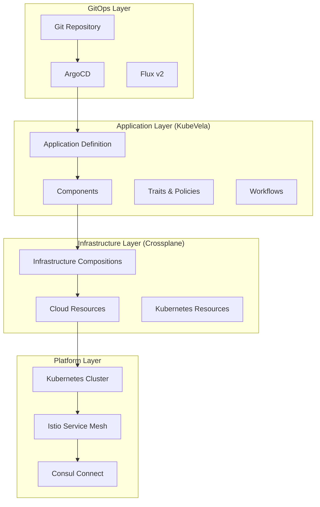
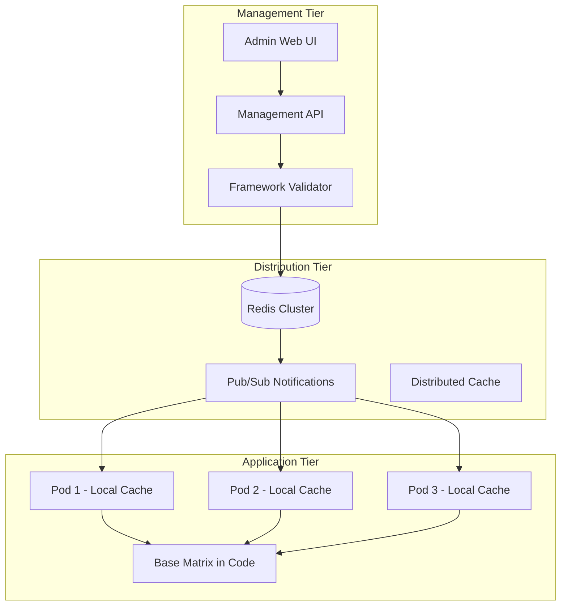

# ReflectAI Future Roadmap & Advanced Deployment Strategy

## 📋 **Document Purpose**

This document captures advanced deployment strategies and infrastructure modernization opportunities for ReflectAI that were analyzed during the initial design phase. These recommendations are marked for **future implementation** and **re-evaluation** after the core system is successfully deployed and stabilized.

**Status**: 🔮 **Future Consideration** - Not part of current implementation scope
**Review Date**: After Phase 1 completion (estimated 6 months post-deployment)
**Priority**: Medium-Low (optimization and enhancement focus)

---

## 🎯 **Executive Summary**

During our comprehensive design analysis, we identified several advanced deployment and infrastructure management approaches that could significantly enhance ReflectAI's operational capabilities. While our current design uses proven, straightforward technologies, these advanced options represent the next evolution of our infrastructure strategy.

### **Current vs Future State**

| Aspect | Current Design (Phase 1) | Future Roadmap (Phase 2+) |
|--------|---------------------------|----------------------------|
| **Deployment** | Docker Compose + Kubernetes manifests | KubeVela + Crossplane |
| **Infrastructure** | Manual K8s resources | Infrastructure as Code |
| **Application Management** | Direct K8s deployment | Application-centric platform |
| **Complexity** | Low-Medium | Medium-High |
| **Maintenance** | Manual | Automated |
| **Scalability** | Good | Excellent |

---

## 🔍 **Technology Stack Analysis**

### **Open Source Compliance Verification**

Our analysis confirmed **100% open source compliance** for the core technology stack:

#### **✅ Fully Open Source & Commercial-Ready**

| Technology | License | Commercial Use | Notes |
|------------|---------|----------------|-------|
| **Python 3.11+** | PSF License | ✅ | No restrictions |
| **FastAPI** | MIT | ✅ | Permissive license |
| **LiteLLM** | MIT | ✅ | Unified LLM interface |
| **LLMLingua** | MIT | ✅ | Prompt compression |
| **Guardrails AI** | Apache 2.0 | ✅ | Output validation |
| **Langfuse** | MIT | ✅ | LLM observability |
| **CrewAI** | MIT | ✅ | Multi-agent orchestration |
| **Temporal.io** | MIT | ✅ | Workflow engine |
| **NATS JetStream** | Apache 2.0 | ✅ | Event streaming |
| **PostgreSQL** | PostgreSQL License | ✅ | Database |
| **TimescaleDB** | Apache 2.0 | ✅ | Time-series extension |
| **Kubernetes** | Apache 2.0 | ✅ | Container orchestration |
| **OpenTelemetry** | Apache 2.0 | ✅ | Observability |
| **VictoriaMetrics** | Apache 2.0 | ✅ | Metrics collection |

#### **⚠️ License Considerations for Future**

| Technology | License | Status | Recommendation |
|------------|---------|--------|----------------|
| **Redis Stack** | BSD/SSPL | Mixed licensing | Use Redis 6.x (BSD) or alternatives |
| **Grafana** | AGPL v3 | Copyleft | Consider alternatives for commercial distribution |

### **Cost Analysis Summary**

- **Infrastructure Costs**: $1,800/month (compute, storage, network)
- **Operational Costs**: $1,200-1,400/month (60-75% LLM cost reduction achieved)
- **Total Monthly**: $3,000-3,200 (vs $3,800 without optimizations)
- **Annual Savings**: $7,200-9,600 through technology optimizations

---

## 🚀 **Advanced Deployment Strategies**

### **1. KubeVela - Application-Centric Platform**

#### **Overview**
KubeVela is an open source application delivery platform that provides higher-level abstractions for Kubernetes deployments using the Open Application Model (OAM).

#### **Strategic Benefits for ReflectAI**

```yaml
# Example KubeVela Application Definition
apiVersion: core.oam.dev/v1beta1
kind: Application
metadata:
  name: reflectai
  namespace: reflectai
spec:
  components:
  - name: reflectai-core
    type: webservice
    properties:
      image: reflectai/core:v2.0.0
      ports:
      - port: 8000
        expose: true
      env:
      - name: DATABASE_URL
        valueFrom:
          secretKeyRef:
            name: reflectai-secrets
            key: database-url
    traits:
    - type: scaler
      properties:
        replicas: 3
    - type: gateway
      properties:
        domain: reflectai.company.com
        http:
          "/api": 8000

  policies:
  - name: topology
    type: topology
    properties:
      namespace: reflectai
      clusters: ["local"]

  workflow:
    steps:
    - name: deploy-database
      type: apply-component
      properties:
        component: postgres
    - name: deploy-app
      type: apply-component
      properties:
        component: reflectai-core
      dependsOn: ["deploy-database"]
```

#### **KubeVela Advantages**
- **Simplified Management**: Hide Kubernetes complexity behind application abstractions
- **Multi-Environment**: Easy promotion across dev/staging/prod environments
- **Built-in Workflows**: Dependency management and sophisticated rollout strategies
- **Extensibility**: Custom components and traits for ReflectAI-specific requirements
- **GitOps Integration**: Native integration with ArgoCD and Flux

#### **Implementation Complexity**
- **Learning Curve**: Medium - requires understanding of OAM concepts
- **Migration Effort**: 2-3 weeks to migrate from current K8s manifests
- **Maintenance**: Lower long-term maintenance due to higher-level abstractions

### **2. Crossplane - Infrastructure as Code**

#### **Overview**
Crossplane is a Kubernetes add-on that enables infrastructure provisioning using Kubernetes APIs, providing cloud-agnostic resource management.

#### **Strategic Benefits for ReflectAI**

```yaml
# Example Crossplane Composition
apiVersion: apiextensions.crossplane.io/v1
kind: Composition
metadata:
  name: reflectai-infrastructure
spec:
  compositeTypeRef:
    apiVersion: reflectai.io/v1alpha1
    kind: XReflectAIInfrastructure

  resources:
  # RDS PostgreSQL Instance
  - name: postgres-instance
    base:
      apiVersion: rds.aws.crossplane.io/v1alpha1
      kind: RDSInstance
      spec:
        forProvider:
          dbInstanceClass: db.t3.micro
          engine: postgres
          engineVersion: "15.4"
          allocatedStorage: 20
          dbName: reflectai
          autoMinorVersionUpgrade: true
          backupRetentionPeriod: 7
          storageEncrypted: true
    patches:
    - type: FromCompositeFieldPath
      fromFieldPath: spec.parameters.dbInstanceClass
      toFieldPath: spec.forProvider.dbInstanceClass

  # ElastiCache Redis Cluster
  - name: redis-cluster
    base:
      apiVersion: cache.aws.crossplane.io/v1alpha1
      kind: ReplicationGroup
      spec:
        forProvider:
          replicationGroupDescription: "ReflectAI Redis Cluster"
          nodeType: cache.t3.micro
          numCacheClusters: 2
          engine: redis
          engineVersion: "7.0"
          atRestEncryptionEnabled: true
          transitEncryptionEnabled: true
```

#### **Crossplane Advantages**
- **Infrastructure as Code**: Manage cloud resources using Kubernetes APIs
- **Cloud Agnostic**: Works with AWS, GCP, Azure, and on-premises
- **Declarative**: Infrastructure state managed declaratively like application code
- **Composition**: Create reusable infrastructure patterns and templates
- **GitOps Native**: Infrastructure changes managed through Git workflows

#### **Implementation Complexity**
- **Learning Curve**: High - requires deep understanding of both Kubernetes and cloud providers
- **Migration Effort**: 4-6 weeks to create compositions and migrate existing infrastructure
- **Maintenance**: Medium - requires ongoing management of compositions and providers

### **3. Hybrid Approach - Best of Both Worlds**

#### **Recommended Architecture**



#### **Hybrid Benefits**
- **Separation of Concerns**: Applications managed by KubeVela, infrastructure by Crossplane
- **Flexibility**: Choose the right tool for each layer
- **Gradual Migration**: Can be adopted incrementally
- **Enterprise Ready**: Scales to complex, multi-environment deployments

---

## 📊 **Deployment Strategy Comparison**

### **Comprehensive Analysis Matrix**

| Criteria | Current (Docker+K8s) | KubeVela | Crossplane | Hybrid |
|----------|----------------------|----------|------------|--------|
| **Initial Complexity** | Low | Medium | High | High |
| **Learning Curve** | Low | Medium | High | High |
| **Flexibility** | Medium | High | Very High | Very High |
| **Maintenance Overhead** | Medium | Low | Medium | Medium |
| **Multi-Environment Support** | Manual | Excellent | Excellent | Excellent |
| **Infrastructure Management** | Manual | Limited | Excellent | Excellent |
| **Application Management** | Manual | Excellent | Limited | Excellent |
| **GitOps Integration** | Basic | Native | Native | Native |
| **Cloud Agnostic** | Yes | Yes | Yes | Yes |
| **Enterprise Features** | Basic | Good | Excellent | Excellent |
| **Team Size Requirement** | 2-3 | 3-4 | 4-6 | 5-8 |
| **Implementation Time** | 2-4 weeks | 4-6 weeks | 6-10 weeks | 8-12 weeks |

### **Recommendation Matrix by Organization Size**

| Organization Size | Recommended Approach | Rationale |
|-------------------|---------------------|-----------|
| **Startup (2-10 people)** | Current (Docker+K8s) | Simple, fast to implement, low maintenance |
| **Small Company (10-50)** | KubeVela | Application-focused, reduces K8s complexity |
| **Medium Company (50-200)** | Hybrid (KubeVela + Crossplane) | Best of both worlds, scalable |
| **Enterprise (200+)** | Full Hybrid + Service Mesh | Complete platform approach |

---

## 🛠 **Integration with Current Infrastructure**

### **Leveraging Existing Assets**

Our analysis of your current infrastructure files reveals excellent foundational work:

#### **Current Infrastructure Strengths**
1. **Comprehensive Docker Setup**: Multi-stage Dockerfile with development/production targets
2. **Flexible Docker Compose**: Supports multiple database and cache configurations
3. **Intelligent Deployment Script**: Feature-rich `deploy.sh` with session affinity and auto-scaling
4. **Security Best Practices**: Non-root containers, health checks, resource limits

#### **Enhancement Opportunities**

**1. Enhanced Docker Compose Integration**
```yaml
# Future: docker-compose.enhanced.yml
version: '3.8'

services:
  reflectai:
    # Your existing configuration enhanced with:
    environment:
      - TEMPORAL_HOST=temporal:7233
      - NATS_SERVERS=nats://nats:4222
      - LANGFUSE_PUBLIC_KEY=${LANGFUSE_PUBLIC_KEY}
      - LITELLM_MASTER_KEY=${LITELLM_MASTER_KEY}
    depends_on:
      - timescaledb  # Enhanced PostgreSQL
      - redis-stack  # Enhanced Redis
      - temporal     # Workflow orchestration
      - nats         # Event streaming
      - langfuse     # LLM observability

  # New services for optimized stack
  timescaledb:
    image: timescale/timescaledb:latest-pg15
    # 100x faster time-series queries

  redis-stack:
    image: redis/redis-stack:latest
    # Enhanced caching with JSON, Search, TimeSeries

  temporal:
    image: temporalio/auto-setup:latest
    # Workflow orchestration replacing Celery

  nats:
    image: nats:latest
    command: ["-js", "-m", "8222"]
    # Event streaming for reliability

  langfuse:
    image: langfuse/langfuse:latest
    # LLM observability and cost tracking
```

**2. Enhanced Kubernetes Deployment**
```bash
# Future: Enhanced deploy.sh additions
deploy_optimized_stack() {
    print_status "Deploying optimized ReflectAI stack..."

    # Deploy TimescaleDB for 100x faster time-series queries
    # Deploy Redis Stack for enhanced caching
    # Deploy Temporal.io for workflow orchestration
    # Deploy NATS JetStream for event streaming
    # Deploy Langfuse for LLM observability

    # All with your existing session affinity and auto-scaling features
}
```

---

## 📅 **Implementation Roadmap**

### **Phase-Based Approach**

#### **Phase 1: Foundation (Current Implementation)**
**Timeline**: Weeks 1-16 (Current scope)
**Status**: ✅ **Active Development**

- Complete current design implementation
- Deploy with Docker Compose + Kubernetes
- Establish monitoring and observability
- Achieve performance and cost targets

#### **Phase 2: Platform Enhancement**
**Timeline**: 6-12 months post Phase 1
**Status**: 🔮 **Future Consideration**

**Objectives**:
- Evaluate KubeVela for application management
- Assess infrastructure complexity and management overhead
- Consider team growth and skill development needs

**Prerequisites**:
- Phase 1 successfully deployed and stable
- Team comfortable with Kubernetes operations
- Clear need for multi-environment management

**Implementation Steps**:
1. **Weeks 1-2**: KubeVela evaluation and proof of concept
2. **Weeks 3-4**: Create Application definitions for ReflectAI
3. **Weeks 5-6**: Migrate development environment to KubeVela
4. **Weeks 7-8**: Production migration and validation

#### **Phase 3: Infrastructure as Code**
**Timeline**: 12-18 months post Phase 1
**Status**: 🔮 **Future Consideration**

**Objectives**:
- Implement Crossplane for infrastructure management
- Achieve full GitOps workflow for infrastructure
- Enable multi-cloud or hybrid cloud deployments

**Prerequisites**:
- Phase 2 completed successfully
- Team has infrastructure management expertise
- Business requires multi-cloud or complex infrastructure

**Implementation Steps**:
1. **Weeks 1-3**: Crossplane installation and provider setup
2. **Weeks 4-6**: Create infrastructure compositions
3. **Weeks 7-9**: Migrate existing infrastructure to Crossplane
4. **Weeks 10-12**: Implement GitOps workflows for infrastructure

#### **Phase 4: Enterprise Platform**
**Timeline**: 18+ months post Phase 1
**Status**: 🔮 **Future Consideration**

**Objectives**:
- Full hybrid platform with KubeVela + Crossplane
- Advanced service mesh integration
- Multi-tenant capabilities
- Enterprise compliance and governance

---

## 💡 **Decision Framework**

### **When to Consider Advanced Deployment Strategies**

#### **Triggers for Phase 2 (KubeVela)**
- [ ] Managing 3+ environments becomes complex
- [ ] Team spends >20% time on Kubernetes manifest management
- [ ] Need for sophisticated deployment workflows
- [ ] Application complexity requires better abstraction

#### **Triggers for Phase 3 (Crossplane)**
- [ ] Managing infrastructure across multiple clouds
- [ ] Infrastructure changes require lengthy approval processes
- [ ] Need for infrastructure self-service capabilities
- [ ] Compliance requires infrastructure as code

#### **Triggers for Phase 4 (Enterprise Platform)**
- [ ] Supporting multiple teams/products on same platform
- [ ] Need for advanced governance and policy enforcement
- [ ] Complex multi-tenant requirements
- [ ] Enterprise compliance mandates

### **Risk Assessment**

#### **Low Risk Indicators** ✅
- Team has strong Kubernetes expertise
- Current system is stable and well-monitored
- Clear business need for advanced capabilities
- Adequate time and resources for migration

#### **High Risk Indicators** ⚠️
- Team lacks Kubernetes operational experience
- Current system has stability issues
- Tight deadlines or resource constraints
- Unclear business justification for complexity

---

## 📋 **Evaluation Checklist**

### **Before Considering Advanced Deployment**

#### **Technical Readiness**
- [ ] Current system deployed and stable for 6+ months
- [ ] Team comfortable with Kubernetes operations
- [ ] Monitoring and alerting fully operational
- [ ] Performance targets consistently met
- [ ] Security requirements satisfied

#### **Business Readiness**
- [ ] Clear business case for advanced capabilities
- [ ] Budget allocated for platform enhancement
- [ ] Team capacity for learning and migration
- [ ] Stakeholder buy-in for increased complexity
- [ ] Timeline allows for gradual migration

#### **Operational Readiness**
- [ ] Documentation and runbooks complete
- [ ] Disaster recovery procedures tested
- [ ] Team cross-training completed
- [ ] Change management processes established
- [ ] Rollback procedures validated

---

## 🎯 **Success Metrics**

### **Phase 2 Success Criteria (KubeVela)**
- **Deployment Time**: 50% reduction in deployment complexity
- **Environment Consistency**: 100% configuration parity across environments
- **Developer Productivity**: 30% reduction in deployment-related tasks
- **Error Rate**: <1% deployment failures

### **Phase 3 Success Criteria (Crossplane)**
- **Infrastructure Provisioning**: 80% reduction in manual infrastructure tasks
- **Compliance**: 100% infrastructure as code coverage
- **Multi-Cloud**: Successful deployment across 2+ cloud providers
- **Self-Service**: 90% of infrastructure requests automated

### **Phase 4 Success Criteria (Enterprise Platform)**
- **Multi-Tenancy**: Support for 5+ teams on shared platform
- **Governance**: 100% policy compliance across all deployments
- **Scalability**: Platform supports 10x current workload
- **Efficiency**: 60% reduction in platform operational overhead

---

## 📚 **Resources and References**

### **Learning Resources**
- [KubeVela Documentation](https://kubevela.io/docs/)
- [Crossplane Documentation](https://crossplane.io/docs/)
- [Open Application Model Specification](https://oam.dev/)
- [CNCF Landscape](https://landscape.cncf.io/)

### **Community and Support**
- KubeVela Community: [GitHub](https://github.com/kubevela/kubevela)
- Crossplane Community: [Slack](https://slack.crossplane.io/)
- CNCF Events and Webinars
- Cloud Native Computing Foundation resources

---

## 🔄 **Review and Update Schedule**

### **Quarterly Reviews**
- **Q1 Post-Deployment**: Assess Phase 1 stability and performance
- **Q2 Post-Deployment**: Evaluate team readiness and business needs
- **Q3 Post-Deployment**: Decision point for Phase 2 initiation
- **Q4 Post-Deployment**: Annual roadmap review and planning

### **Annual Strategic Review**
- Technology landscape assessment
- Business requirements evolution
- Team capability development
- Platform strategy alignment

---

**Document Version**: 1.0
**Last Updated**: December 2024
**Next Review**: Q2 2025 (6 months post Phase 1 completion)
**Owner**: Platform Engineering Team
**Stakeholders**: Engineering Leadership, DevOps Team, Product Management

---

*This document serves as a strategic reference for future platform evolution. All recommendations should be re-evaluated based on actual Phase 1 outcomes, team growth, and business requirements at the time of consideration.*
-
--

## 🎯 **Advanced Competency Management System**

### **Status**: 🔮 **Future Enhancement** - Phase 3+ Implementation
**Priority**: Medium (Operational Enhancement)
**Timeline**: 12-18 months post Phase 1 completion
**Complexity**: Medium-High

### **Overview**

During our design analysis, we identified an advanced Redis-based competency management system that would provide significant operational benefits for managing competency frameworks without code deployments.

### **Current Approach vs Future Enhancement**

| Aspect | Current (Phase 1) | Future Enhancement |
|--------|-------------------|-------------------|
| **Loading** | Startup loading from JSON file | Startup + Redis distributed cache |
| **Updates** | Requires code deployment | Real-time updates via UI |
| **Management** | Developer-only | HR/Admin friendly UI |
| **Consistency** | File-based per pod | Redis-based cluster-wide |
| **Fallback** | None | Base matrix in source code |

### **Detailed Architecture Analysis**

#### **Redis-Based Distributed Competency Management**

The future system would implement a three-tier architecture:



#### **Key Components**

**1. Base Matrix in Source Code (Reliability Layer)**
```python
# Future: src/core/competency/base_matrix.py
BASE_COMPETENCY_MATRIX = {
    "metadata": {"name": "Base Framework", "version": "1.0.0"},
    "levels": {"P1": {...}, "P2": {...}},
    "categories": {"Software delivery": {...}}
}
```

**2. Redis Distributed Cache (Performance Layer)**
```python
# Future: src/core/competency/redis_manager.py
class CompetencyRedisManager:
    async def store_framework(self, name: str, data: Dict) -> bool
    async def get_active_framework(self) -> Dict
    async def notify_all_pods(self, framework_name: str) -> None
```

**3. Pod-Level Cache Manager (Access Layer)**
```python
# Future: src/core/competency/pod_cache_manager.py
class PodCompetencyManager:
    async def initialize(self) -> bool  # Load from Redis or fallback
    def get_competency_matrix(self) -> Dict  # O(1) local access
    async def handle_redis_updates(self) -> None  # Real-time sync
```

**4. Management UI (Operational Layer)**
- Web interface for HR/Admin users
- Framework CRUD operations
- Validation and preview capabilities
- Audit trail and version history
- One-click activation across all pods

#### **Implementation Benefits**

**Operational Excellence:**
- ✅ **Non-Technical Management**: HR/Admin can update competencies
- ✅ **Zero-Downtime Updates**: No pod restarts required
- ✅ **Immediate Propagation**: Changes available cluster-wide in seconds
- ✅ **Audit Trail**: Complete change history with user attribution
- ✅ **Easy Rollback**: Revert to previous versions instantly

**Technical Benefits:**
- ✅ **High Performance**: Local cache + Redis = sub-millisecond access
- ✅ **High Availability**: Base matrix fallback prevents failures
- ✅ **Consistency**: All pods always have identical data
- ✅ **Scalability**: Works with unlimited pod count

**Development Benefits:**
- ✅ **No Deployment Overhead**: Competency changes don't require releases
- ✅ **Environment Agnostic**: Same system works dev/staging/prod
- ✅ **Testing Friendly**: Easy A/B testing of different frameworks
- ✅ **Backward Compatible**: Existing code continues to work

#### **Implementation Phases**

**Phase 1: Foundation (Weeks 1-2)**
- Embed base competency matrix in source code
- Implement Redis storage and retrieval layer
- Create pod-level cache manager with fallback logic

**Phase 2: Distribution (Weeks 3-4)**
- Implement Redis pub/sub for real-time updates
- Add framework validation and business rules
- Create REST API for framework management

**Phase 3: Management Interface (Weeks 5-6)**
- Build web UI for competency framework management
- Implement user authentication and authorization
- Add audit trail and version history features

**Phase 4: Advanced Features (Weeks 7-8)**
- Multi-organization framework support
- A/B testing capabilities for framework changes
- Analytics and usage metrics dashboard

#### **Technical Considerations**

**Complexity Assessment:**
- **Not Over-Engineering**: Solves real operational problems
- **Appropriate Complexity**: Each component has clear responsibility
- **Future-Proof**: Scales with organizational growth
- **Pragmatic**: Balances simplicity with operational needs

**Risk Mitigation:**
- **Redis Failure**: Base matrix in code provides fallback
- **Network Issues**: Local cache continues serving requests
- **Invalid Updates**: Validation prevents broken configurations
- **Rollback Safety**: Previous versions always available

#### **Decision Criteria for Implementation**

**Implement When:**
- [ ] Multiple non-technical users need to manage competencies
- [ ] Competency updates become more frequent (monthly vs yearly)
- [ ] Multiple organizations/teams need different frameworks
- [ ] Deployment overhead for config changes becomes problematic
- [ ] Team has capacity for Redis infrastructure management

**Skip If:**
- [ ] Competencies rarely change (less than quarterly)
- [ ] Only technical users manage competencies
- [ ] Single organization with uniform competency needs
- [ ] Team prefers simpler deployment-based updates

### **Integration with Current Design**

This enhancement would integrate seamlessly with the current design:

**Current Startup Loading (Phase 1):**
```python
# Current: Load once at startup
with open("data/competency_matrix.json", "r") as f:
    competency_matrix = json.load(f)
```

**Future Enhanced Loading (Phase 3+):**
```python
# Future: Startup + Redis with fallback
class CompetencyManager:
    async def initialize(self):
        try:
            # Try Redis first
            self.matrix = await self.redis_manager.get_active_framework()
        except:
            # Fallback to base matrix in code
            self.matrix = BASE_COMPETENCY_MATRIX
```

### **Cost-Benefit Analysis**

**Implementation Cost:**
- **Development**: 6-8 weeks additional development
- **Infrastructure**: Redis cluster management overhead
- **Maintenance**: Additional monitoring and backup procedures

**Operational Benefits:**
- **Time Savings**: 80% reduction in competency update time
- **User Experience**: Non-technical users can manage frameworks
- **Deployment Efficiency**: Eliminate config-only deployments
- **Consistency**: Guaranteed cluster-wide consistency

**ROI Timeline:**
- **Break-even**: 6-12 months (depending on update frequency)
- **Long-term Value**: High for growing organizations
- **Risk Reduction**: Eliminates deployment risks for config changes

---

**Document Updated**: December 2024
**Next Review**: After Phase 1 completion and operational experience
**Decision Point**: Evaluate based on actual competency update frequency and user feedback
