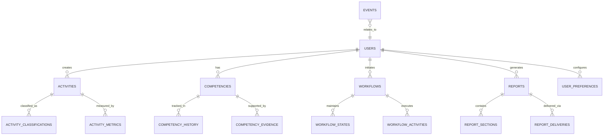

# ReflectAI Database Schema and ERD

## Overview

This document defines the complete database schema for ReflectAI's fresh implementation, utilizing PostgreSQL 15+ with TimescaleDB extension for time-series data optimization.

## Database Architecture

- **Primary Database**: PostgreSQL 15+ with TimescaleDB extension
- **Time-Series Tables**: Activities, events, metrics (hypertables)
- **Relational Tables**: Users, competencies, workflows, reports
- **Audit Database**: Separate PostgreSQL instance for audit logs (7-year retention)
- **Connection Pooling**: PgBouncer for 1000+ concurrent connections

## Core Entities and Relationships



## Table Definitions

### 1. Core Entity Tables

#### users
Primary user entity table with Slack integration and profile data.

```sql
CREATE TABLE users (
    id UUID PRIMARY KEY DEFAULT gen_random_uuid(),
    slack_user_id VARCHAR(50) UNIQUE NOT NULL,
    email VARCHAR(255) UNIQUE,
    display_name VARCHAR(100),
    real_name VARCHAR(100),
    team_id VARCHAR(50) NOT NULL,
    profile_data JSONB DEFAULT '{}',
    timezone VARCHAR(50) DEFAULT 'UTC',
    is_active BOOLEAN DEFAULT true,
    last_activity_at TIMESTAMPTZ,
    created_at TIMESTAMPTZ DEFAULT now(),
    updated_at TIMESTAMPTZ DEFAULT now()
);

-- Indexes
CREATE INDEX idx_users_slack_user_id ON users(slack_user_id);
CREATE INDEX idx_users_team_id ON users(team_id);
CREATE INDEX idx_users_email ON users(email);
CREATE INDEX idx_users_active_last_activity ON users(is_active, last_activity_at);
```

**Profile Data JSONB Structure**:
```json
{
    "avatar_url": "https://...",
    "role": "Software Engineer",
    "department": "Engineering",
    "manager_id": "U123456",
    "career_level": "Senior",
    "skills": ["Python", "React", "AWS"],
    "goals": ["Get promoted", "Learn Kubernetes"],
    "preferences": {
        "notification_frequency": "daily",
        "report_format": "slack"
    }
}
```

#### activities (TimescaleDB Hypertable)
User activity data optimized for time-series queries with 7-day partitioning.

```sql
CREATE TABLE activities (
    id UUID PRIMARY KEY DEFAULT gen_random_uuid(),
    user_id UUID NOT NULL REFERENCES users(id) ON DELETE CASCADE,
    content TEXT NOT NULL,
    activity_type VARCHAR(50),
    source VARCHAR(50) DEFAULT 'slack', -- slack, manual, api
    classification JSONB DEFAULT '{}',
    metrics JSONB DEFAULT '{}',
    processing_status VARCHAR(20) DEFAULT 'pending', -- pending, processing, complete, failed
    confidence_score DECIMAL(3,2),
    created_at TIMESTAMPTZ DEFAULT now(),
    processed_at TIMESTAMPTZ,
    
    -- TimescaleDB partitioning
    CONSTRAINT activities_created_at_check CHECK (created_at IS NOT NULL)
);

-- Convert to hypertable with 7-day chunks
SELECT create_hypertable('activities', 'created_at', chunk_time_interval => INTERVAL '7 days');

-- Indexes
CREATE INDEX idx_activities_user_id_time ON activities(user_id, created_at DESC);
CREATE INDEX idx_activities_type_time ON activities(activity_type, created_at DESC);
CREATE INDEX idx_activities_status ON activities(processing_status);
CREATE INDEX idx_activities_confidence ON activities(confidence_score);
```

**Classification JSONB Structure**:
```json
{
    "primary_competency": "Technical Skills",
    "secondary_competencies": ["Leadership", "Communication"],
    "confidence": 0.85,
    "complexity_level": "intermediate",
    "impact_level": "high",
    "keywords": ["code review", "mentoring", "architecture"],
    "classifier_version": "1.2.0",
    "processing_time_ms": 1250
}
```

**Metrics JSONB Structure**:
```json
{
    "word_count": 45,
    "complexity_score": 7.2,
    "technical_depth": 8.5,
    "collaboration_score": 6.0,
    "innovation_score": 3.5,
    "time_spent_minutes": 120,
    "quality_indicators": {
        "clarity": 8.0,
        "thoroughness": 9.0,
        "impact": 7.5
    }
}
```

#### competencies
Current competency scores and metadata for each user.

```sql
CREATE TABLE competencies (
    id UUID PRIMARY KEY DEFAULT gen_random_uuid(),
    user_id UUID NOT NULL REFERENCES users(id) ON DELETE CASCADE,
    competency_area VARCHAR(100) NOT NULL,
    score DECIMAL(3,2) NOT NULL CHECK (score >= 0 AND score <= 5),
    level VARCHAR(20), -- beginner, intermediate, advanced, expert, master
    evidence JSONB DEFAULT '{}',
    last_activity_date DATE,
    activity_count INTEGER DEFAULT 0,
    trend_direction VARCHAR(10), -- rising, stable, declining
    confidence DECIMAL(3,2) DEFAULT 0.0,
    updated_at TIMESTAMPTZ DEFAULT now(),
    
    UNIQUE(user_id, competency_area)
);

-- Indexes
CREATE INDEX idx_competencies_user_id ON competencies(user_id);
CREATE INDEX idx_competencies_area ON competencies(competency_area);
CREATE INDEX idx_competencies_score ON competencies(score DESC);
CREATE INDEX idx_competencies_updated ON competencies(updated_at DESC);
```

**Evidence JSONB Structure**:
```json
{
    "recent_activities": [
        {
            "activity_id": "uuid",
            "date": "2024-09-05",
            "impact_score": 8.5,
            "description": "Led architecture review meeting"
        }
    ],
    "skill_demonstrations": [
        {
            "skill": "System Design",
            "examples": 5,
            "avg_quality": 8.2
        }
    ],
    "growth_indicators": {
        "velocity": 0.3,
        "consistency": 0.8,
        "depth": 0.9
    },
    "peer_feedback": {
        "count": 3,
        "avg_score": 4.2
    }
}
```

### 2. Time-Series Tables

#### competency_history (TimescaleDB Hypertable)
Historical tracking of competency score changes over time.

```sql
CREATE TABLE competency_history (
    id UUID PRIMARY KEY DEFAULT gen_random_uuid(),
    user_id UUID NOT NULL REFERENCES users(id) ON DELETE CASCADE,
    competency_area VARCHAR(100) NOT NULL,
    score DECIMAL(3,2) NOT NULL,
    previous_score DECIMAL(3,2),
    change_reason VARCHAR(100), -- activity_added, manual_adjustment, recalculation
    contributing_activity_id UUID REFERENCES activities(id),
    created_at TIMESTAMPTZ DEFAULT now(),
    
    CONSTRAINT competency_history_created_at_check CHECK (created_at IS NOT NULL)
);

-- Convert to hypertable
SELECT create_hypertable('competency_history', 'created_at', chunk_time_interval => INTERVAL '30 days');

-- Indexes
CREATE INDEX idx_competency_history_user_area_time ON competency_history(user_id, competency_area, created_at DESC);
CREATE INDEX idx_competency_history_area_time ON competency_history(competency_area, created_at DESC);
```

#### events (TimescaleDB Hypertable)
System event logging for observability and analytics.

```sql
CREATE TABLE events (
    id UUID PRIMARY KEY DEFAULT gen_random_uuid(),
    event_type VARCHAR(100) NOT NULL,
    user_id UUID REFERENCES users(id) ON DELETE SET NULL,
    team_id VARCHAR(50),
    correlation_id UUID,
    event_data JSONB DEFAULT '{}',
    source VARCHAR(50) NOT NULL, -- slack, temporal, system, api
    severity VARCHAR(20) DEFAULT 'info', -- debug, info, warning, error, critical
    created_at TIMESTAMPTZ DEFAULT now(),
    
    CONSTRAINT events_created_at_check CHECK (created_at IS NOT NULL)
);

-- Convert to hypertable
SELECT create_hypertable('events', 'created_at', chunk_time_interval => INTERVAL '1 day');

-- Indexes
CREATE INDEX idx_events_type_time ON events(event_type, created_at DESC);
CREATE INDEX idx_events_user_time ON events(user_id, created_at DESC);
CREATE INDEX idx_events_correlation ON events(correlation_id);
CREATE INDEX idx_events_severity_time ON events(severity, created_at DESC);
```

### 3. Workflow Management Tables

#### workflows
Temporal workflow tracking and state management.

```sql
CREATE TABLE workflows (
    id UUID PRIMARY KEY DEFAULT gen_random_uuid(),
    temporal_workflow_id VARCHAR(255) UNIQUE NOT NULL,
    user_id UUID NOT NULL REFERENCES users(id) ON DELETE CASCADE,
    workflow_type VARCHAR(50) NOT NULL, -- sequential_analysis, batch_analysis, conversation, report_generation
    status VARCHAR(20) DEFAULT 'running', -- running, completed, failed, terminated, cancelled
    input_data JSONB DEFAULT '{}',
    state JSONB DEFAULT '{}',
    result_data JSONB DEFAULT '{}',
    error_details JSONB,
    priority VARCHAR(10) DEFAULT 'normal', -- low, normal, high, urgent
    started_at TIMESTAMPTZ DEFAULT now(),
    completed_at TIMESTAMPTZ,
    created_at TIMESTAMPTZ DEFAULT now()
);

-- Indexes
CREATE INDEX idx_workflows_temporal_id ON workflows(temporal_workflow_id);
CREATE INDEX idx_workflows_user_status ON workflows(user_id, status);
CREATE INDEX idx_workflows_type_status ON workflows(workflow_type, status);
CREATE INDEX idx_workflows_priority_created ON workflows(priority, created_at DESC);
```

#### workflow_activities
Individual activity tracking within Temporal workflows.

```sql
CREATE TABLE workflow_activities (
    id UUID PRIMARY KEY DEFAULT gen_random_uuid(),
    workflow_id UUID NOT NULL REFERENCES workflows(id) ON DELETE CASCADE,
    activity_name VARCHAR(100) NOT NULL,
    activity_type VARCHAR(50) NOT NULL, -- analysis, advice, notification, storage
    status VARCHAR(20) DEFAULT 'scheduled', -- scheduled, running, completed, failed, retrying
    input_data JSONB DEFAULT '{}',
    output_data JSONB DEFAULT '{}',
    error_details JSONB,
    retry_count INTEGER DEFAULT 0,
    started_at TIMESTAMPTZ,
    completed_at TIMESTAMPTZ,
    duration_ms INTEGER,
    created_at TIMESTAMPTZ DEFAULT now()
);

-- Indexes
CREATE INDEX idx_workflow_activities_workflow ON workflow_activities(workflow_id);
CREATE INDEX idx_workflow_activities_status ON workflow_activities(status);
CREATE INDEX idx_workflow_activities_type_status ON workflow_activities(activity_type, status);
```

### 4. Reporting and Analytics Tables

#### reports
Generated report metadata and tracking.

```sql
CREATE TABLE reports (
    id UUID PRIMARY KEY DEFAULT gen_random_uuid(),
    user_id UUID NOT NULL REFERENCES users(id) ON DELETE CASCADE,
    report_type VARCHAR(50) NOT NULL, -- competency_analysis, weekly_summary, career_development
    title VARCHAR(255) NOT NULL,
    description TEXT,
    parameters JSONB DEFAULT '{}', -- date_range, competency_filter, detail_level
    format VARCHAR(20) NOT NULL, -- slack, pdf, json
    status VARCHAR(20) DEFAULT 'generating', -- generating, completed, failed, delivered
    file_path VARCHAR(500),
    file_size_bytes INTEGER,
    secure_url VARCHAR(500),
    expires_at TIMESTAMPTZ,
    generated_by VARCHAR(50) DEFAULT 'system', -- system, user_request, scheduled
    created_at TIMESTAMPTZ DEFAULT now(),
    completed_at TIMESTAMPTZ
);

-- Indexes
CREATE INDEX idx_reports_user_type ON reports(user_id, report_type);
CREATE INDEX idx_reports_status ON reports(status);
CREATE INDEX idx_reports_created ON reports(created_at DESC);
CREATE INDEX idx_reports_expires ON reports(expires_at) WHERE expires_at IS NOT NULL;
```

#### report_deliveries
Report delivery tracking across multiple channels.

```sql
CREATE TABLE report_deliveries (
    id UUID PRIMARY KEY DEFAULT gen_random_uuid(),
    report_id UUID NOT NULL REFERENCES reports(id) ON DELETE CASCADE,
    delivery_method VARCHAR(50) NOT NULL, -- slack_thread, slack_dm, pdf_download, email
    recipient VARCHAR(255) NOT NULL, -- user_id, channel_id, email
    status VARCHAR(20) DEFAULT 'pending', -- pending, sent, delivered, failed
    delivery_data JSONB DEFAULT '{}', -- message_id, thread_ts, email_id
    error_details JSONB,
    attempted_at TIMESTAMPTZ DEFAULT now(),
    delivered_at TIMESTAMPTZ
);

-- Indexes
CREATE INDEX idx_report_deliveries_report ON report_deliveries(report_id);
CREATE INDEX idx_report_deliveries_status ON report_deliveries(status);
CREATE INDEX idx_report_deliveries_method ON report_deliveries(delivery_method);
```

### 5. Configuration and Preferences Tables

#### user_preferences
User-specific configuration and notification preferences.

```sql
CREATE TABLE user_preferences (
    id UUID PRIMARY KEY DEFAULT gen_random_uuid(),
    user_id UUID NOT NULL REFERENCES users(id) ON DELETE CASCADE UNIQUE,
    notification_preferences JSONB DEFAULT '{}',
    report_preferences JSONB DEFAULT '{}',
    ui_preferences JSONB DEFAULT '{}',
    privacy_settings JSONB DEFAULT '{}',
    created_at TIMESTAMPTZ DEFAULT now(),
    updated_at TIMESTAMPTZ DEFAULT now()
);

-- Indexes
CREATE UNIQUE INDEX idx_user_preferences_user_id ON user_preferences(user_id);
```

**Notification Preferences JSONB Structure**:
```json
{
    "allow_proactive_dms": true,
    "preferred_dm_time": "09:00",
    "frequency_limits": {
        "daily_updates": 1,
        "weekly_summaries": 1,
        "milestone_alerts": 5,
        "error_notifications": 3
    },
    "quiet_hours": {
        "start": "18:00",
        "end": "08:00"
    },
    "timezone": "America/New_York",
    "notification_types": {
        "workflow_progress": true,
        "analysis_complete": true,
        "report_ready": true,
        "system_alerts": true
    }
}
```

### 6. Cache and Session Tables

#### user_sessions
Redis-backed session data with PostgreSQL fallback.

```sql
CREATE TABLE user_sessions (
    id UUID PRIMARY KEY DEFAULT gen_random_uuid(),
    user_id UUID NOT NULL REFERENCES users(id) ON DELETE CASCADE,
    session_token VARCHAR(255) UNIQUE NOT NULL,
    session_data JSONB DEFAULT '{}',
    expires_at TIMESTAMPTZ NOT NULL,
    created_at TIMESTAMPTZ DEFAULT now(),
    last_accessed_at TIMESTAMPTZ DEFAULT now()
);

-- Indexes
CREATE INDEX idx_user_sessions_user ON user_sessions(user_id);
CREATE INDEX idx_user_sessions_token ON user_sessions(session_token);
CREATE INDEX idx_user_sessions_expires ON user_sessions(expires_at);
```

### 7. Audit and Security Tables (Separate Database)

#### audit_events
Comprehensive audit logging for security and compliance (separate database).

```sql
-- Separate audit database: reflectai_audit
CREATE TABLE audit_events (
    id UUID PRIMARY KEY DEFAULT gen_random_uuid(),
    event_type VARCHAR(100) NOT NULL, -- login, logout, data_access, data_modify, admin_action
    user_id UUID, -- May reference users in main DB
    resource_type VARCHAR(50), -- user, activity, competency, report, system
    resource_id VARCHAR(255),
    action VARCHAR(50) NOT NULL, -- create, read, update, delete, access, export
    old_values JSONB,
    new_values JSONB,
    ip_address INET,
    user_agent TEXT,
    session_id VARCHAR(255),
    result VARCHAR(20) DEFAULT 'success', -- success, failure, unauthorized
    created_at TIMESTAMPTZ DEFAULT now()
);

-- Indexes
CREATE INDEX idx_audit_events_type_time ON audit_events(event_type, created_at DESC);
CREATE INDEX idx_audit_events_user_time ON audit_events(user_id, created_at DESC);
CREATE INDEX idx_audit_events_resource ON audit_events(resource_type, resource_id);
CREATE INDEX idx_audit_events_action ON audit_events(action, created_at DESC);
```

## Data Retention Policies

### TimescaleDB Retention Policies

```sql
-- Activities: 2-year retention with compression
SELECT add_retention_policy('activities', INTERVAL '2 years');
SELECT add_compression_policy('activities', INTERVAL '6 months');

-- Competency History: 5-year retention with compression  
SELECT add_retention_policy('competency_history', INTERVAL '5 years');
SELECT add_compression_policy('competency_history', INTERVAL '1 year');

-- Events: 1-year retention with compression
SELECT add_retention_policy('events', INTERVAL '1 year');
SELECT add_compression_policy('events', INTERVAL '3 months');

-- Audit Events: 7-year retention (compliance requirement)
-- Applied to audit database
SELECT add_retention_policy('audit_events', INTERVAL '7 years');
SELECT add_compression_policy('audit_events', INTERVAL '1 year');
```

### Regular Data Cleanup

```sql
-- Expired sessions cleanup
DELETE FROM user_sessions WHERE expires_at < now() - INTERVAL '1 day';

-- Expired reports cleanup  
DELETE FROM reports WHERE expires_at IS NOT NULL AND expires_at < now();

-- Failed workflow cleanup (older than 30 days)
DELETE FROM workflows WHERE status = 'failed' AND created_at < now() - INTERVAL '30 days';
```

## Continuous Aggregates (Performance Optimization)

### Daily User Activity Summary

```sql
CREATE MATERIALIZED VIEW daily_user_activities
WITH (timescaledb.continuous) AS
SELECT 
    time_bucket('1 day', created_at) AS day,
    user_id,
    COUNT(*) AS activity_count,
    COUNT(DISTINCT activity_type) AS unique_activity_types,
    AVG(confidence_score) AS avg_confidence,
    AVG((metrics->>'complexity_score')::numeric) AS avg_complexity
FROM activities 
WHERE confidence_score IS NOT NULL
GROUP BY day, user_id;

SELECT add_continuous_aggregate_policy('daily_user_activities',
    start_offset => INTERVAL '1 month',
    end_offset => INTERVAL '1 day',
    schedule_interval => INTERVAL '1 hour');
```

### Weekly Competency Trends

```sql
CREATE MATERIALIZED VIEW weekly_competency_trends
WITH (timescaledb.continuous) AS
SELECT 
    time_bucket('1 week', created_at) AS week,
    competency_area,
    COUNT(*) AS score_updates,
    AVG(score) AS avg_score,
    MAX(score) AS max_score,
    MIN(score) AS min_score
FROM competency_history
GROUP BY week, competency_area;

SELECT add_continuous_aggregate_policy('weekly_competency_trends',
    start_offset => INTERVAL '6 months',
    end_offset => INTERVAL '1 week',
    schedule_interval => INTERVAL '1 day');
```

## Migration Strategy

### Alembic Migration Setup

```python
# alembic/env.py configuration for async support
from sqlalchemy.ext.asyncio import create_async_engine

# Migration version format: YYYY_MM_DD_HHMMSS_description
# Example: 2024_09_07_141030_create_users_table.py
```

### Data Migration from Existing System

1. **User Data Migration**:
   - Extract user profiles from existing system
   - Map Slack user IDs to new user table
   - Preserve user preferences and settings

2. **Activity Data Migration**:
   - Transform existing activity data to new schema
   - Recalculate competency scores using new algorithms
   - Maintain temporal relationships

3. **Configuration Migration**:
   - Migrate environment variables to Doppler
   - Update database connection strings
   - Preserve OAuth tokens and API keys

## Performance Considerations

### Connection Pooling (PgBouncer)

```ini
[databases]
reflectai = host=postgres-primary port=5432 dbname=reflectai
reflectai_audit = host=postgres-audit port=5432 dbname=reflectai_audit

[pgbouncer]
pool_mode = transaction
max_client_conn = 1000
default_pool_size = 25
max_db_connections = 100
```

### Query Optimization

- **Composite Indexes**: Optimized for common query patterns
- **Partial Indexes**: Only index active/relevant data
- **JSONB Indexes**: GIN indexes on frequently queried JSONB fields
- **Time-based Partitioning**: TimescaleDB automatic partitioning

### Monitoring Queries

```sql
-- Most expensive queries
SELECT query, mean_exec_time, calls 
FROM pg_stat_statements 
ORDER BY mean_exec_time DESC 
LIMIT 10;

-- Table sizes and index usage
SELECT 
    schemaname, tablename,
    pg_size_pretty(pg_total_relation_size(schemaname||'.'||tablename)) as size,
    pg_stat_user_tables.n_tup_ins + pg_stat_user_tables.n_tup_upd + pg_stat_user_tables.n_tup_del as modifications
FROM pg_tables 
LEFT JOIN pg_stat_user_tables ON pg_tables.tablename = pg_stat_user_tables.relname
WHERE schemaname = 'public'
ORDER BY pg_total_relation_size(schemaname||'.'||tablename) DESC;
```

This schema provides a solid foundation for the ReflectAI system with proper time-series optimization, audit trails, and performance considerations built in from the start.