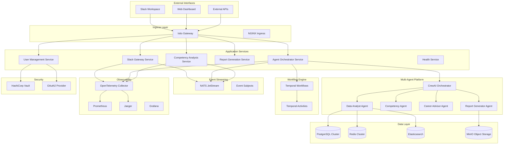

# ReflectAI Enterprise Architecture

## Executive Summary

ReflectAI Enterprise is a cloud-native, multi-agent competency analysis platform built entirely with open-source technologies. The system transforms traditional competency assessment through intelligent agent orchestration, event-driven architecture, and comprehensive observability.

## Architecture Principles

### 1. **Open Source First**
- 100% open-source technology stack
- No vendor lock-in or proprietary dependencies
- Community-driven innovation and support
- Transparent licensing and compliance

### 2. **Cloud-Native Design**
- Kubernetes-native deployment and scaling
- Microservices architecture with loose coupling
- Event-driven communication patterns
- Infrastructure as Code (IaC) approach

### 3. **Observability by Design**
- OpenTelemetry for distributed tracing
- Prometheus metrics with custom business KPIs
- Structured logging with correlation IDs
- Real-time monitoring and alerting

### 4. **Security by Default**
- Zero-trust networking with mTLS
- OAuth2/OIDC enterprise authentication
- Secrets management with HashiCorp Vault
- Network policies and pod security standards

## High-Level System Architecture



## Core Services Architecture

### 1. Slack Gateway Service

**Purpose**: Handle both WebSocket and HTTP Slack integrations with dual-mode support.

```python
# Dual-mode Slack integration
class SlackGatewayService:
    def __init__(self):
        self.app = FastAPI(title="Slack Gateway Service")
        self.nats_client = NATSClient()
        self.slack_app = App(token=SLACK_BOT_TOKEN)
        self.socket_handler = None
        self.setup_routes()
        self.setup_websocket_mode()

    def setup_websocket_mode(self):
        """Setup WebSocket mode for development/testing"""
        if SLACK_MODE == "socket":
            self.socket_handler = SocketModeHandler(
                self.slack_app,
                SLACK_APP_TOKEN
            )

    def setup_routes(self):
        """Setup HTTP endpoints for production"""
        @self.app.post("/slack/events")
        async def handle_slack_event(event: SlackEvent):
            # Immediate response (3-second rule)
            await self.nats_client.publish(
                "slack.events.received",
                event.dict()
            )
            return {"status": "accepted"}

    async def start_dual_mode(self):
        """Start both WebSocket and HTTP modes"""
        if self.socket_handler:
            # Start WebSocket in background
            asyncio.create_task(self.socket_handler.start_async())

        # HTTP server always available
        uvicorn.run(self.app, host="0.0.0.0", port=8000)
```

**Features**:
- **Dual Protocol Support**: WebSocket for development, HTTP for production
- **Immediate Response**: 3-second Slack requirement compliance
- **Event Publishing**: NATS JetStream for async processing
- **Health Checks**: Comprehensive endpoint monitoring
- **Rate Limiting**: Built-in protection against abuse

### 2. Agent Orchestrator Service

**Purpose**: Intelligent routing between enhanced single-agent and multi-agent processing.

```python
# Enhanced workflow with intelligent routing
@workflow.defn
class EnhancedCompetencyAnalysisWorkflow:
    @workflow.run
    async def run(self, request: AnalysisRequest) -> AnalysisResult:
        # Enhanced intent analysis with confidence scoring
        intent_analysis = await workflow.execute_activity(
            analyze_user_intent_enhanced,
            request.message,
            request.user_context,
            start_to_close_timeout=timedelta(seconds=30)
        )

        # Route based on intent and complexity
        if intent_analysis.requires_multi_agent():
            return await workflow.execute_activity(
                execute_multi_agent_analysis,
                request,
                start_to_close_timeout=timedelta(minutes=10)
            )
        elif intent_analysis.needs_clarification():
            return await workflow.execute_activity(
                generate_clarification_questions,
                request,
                intent_analysis,
                start_to_close_timeout=timedelta(seconds=30)
            )
        else:
            return await workflow.execute_activity(
                execute_enhanced_single_agent,
                request,
                intent_analysis,
                start_to_close_timeout=timedelta(minutes=5)
            )
```

**Enhanced Features**:
- **Advanced Intent Analysis**: LLM-powered intent detection with confidence scoring
- **Interactive Clarification**: Ask follow-up questions when intent is unclear
- **Context-Aware Routing**: Consider user context in routing decisions
- **Conversational Support**: Handle general questions and provide guidance
- **Fallback Mechanisms**: Multiple fallback layers for reliability
- **User Context Preservation**: Maintain user context throughout workflows

**Supported Intent Types**:
```python
class UserIntent(Enum):
    # Core functionality (preserved)
    CLASSIFY_ACTIVITY = "classify_activity"
    SUMMARIZE_CONTENT = "summarize_content"
    STORE_ACTIVITY = "store_activity"
    GENERATE_REPORT = "generate_report"

    # Enhanced capabilities
    ANALYZE_AND_STORE = "analyze_and_store"  # Full workflow
    COMPREHENSIVE_ANALYSIS = "comprehensive_analysis"  # Multi-agent
    CLARIFICATION_NEEDED = "clarification_needed"  # Interactive
    GENERAL_QUESTION = "general_question"  # Conversational
```

### 3. Multi-Agent Platform

**Purpose**: Collaborative AI agents for comprehensive competency analysis.

```python
# CrewAI-based multi-agent system
class EnterpriseAgentCrew:
    def __init__(self):
        self.agents = {
            'data_analyst': Agent(
                role='Senior Data Analyst',
                goal='Extract and analyze comprehensive user data patterns',
                tools=[
                    EnhancedDataRetrievalTool(),
                    TrendAnalysisTool(),
                    StatisticalAnalysisTool()
                ],
                llm=self.get_llm_with_tracing(),
                memory=True
            ),

            'competency_specialist': Agent(
                role='Competency Assessment Specialist',
                goal='Provide detailed competency analysis with benchmarks',
                tools=[
                    AdvancedClassificationTool(),
                    BenchmarkingTool(),
                    SkillGapAnalysisTool()
                ],
                llm=self.get_llm_with_tracing(),
                memory=True
            ),

            'career_strategist': Agent(
                role='Senior Career Development Strategist',
                goal='Develop comprehensive career advancement strategies',
                tools=[
                    CareerPathAnalysisTool(),
                    PromotionReadinessTool(),
                    DevelopmentPlanTool()
                ],
                llm=self.get_llm_with_tracing(),
                memory=True
            ),

            'insights_synthesizer': Agent(
                role='Executive Insights Synthesizer',
                goal='Synthesize analysis into actionable insights',
                tools=[
                    ReportSynthesisTool(),
                    VisualizationTool(),
                    RecommendationEngineTool()
                ],
                llm=self.get_llm_with_tracing(),
                memory=True
            )
        }

    def get_llm_with_tracing(self):
        """Get LLM client with OpenTelemetry tracing"""
        return TracedChatOpenAI(
            base_llm=get_chatopen_ai_llm(),
            tracer=trace.get_tracer(__name__)
        )
```

**Agent Specializations**:

1. **Data Analyst Agent**
   - Historical activity analysis
   - Trend identification and pattern recognition
   - Statistical competency modeling
   - Performance benchmarking

2. **Competency Specialist Agent**
   - Activity classification and categorization
   - Skill level assessment and rating
   - Gap analysis and improvement areas
   - Industry standard comparisons

3. **Career Strategist Agent**
   - Promotion readiness evaluation
   - Career path recommendations
   - Development plan creation
   - Strategic guidance and mentoring

4. **Insights Synthesizer Agent**
   - Multi-faceted analysis synthesis
   - Report generation and formatting
   - Visualization and presentation
   - Actionable recommendation creation

## Event-Driven Architecture with NATS JetStream

### Why NATS JetStream Over Kafka

| Feature | NATS JetStream | Apache Kafka | Decision |
|---------|----------------|--------------|----------|
| **Deployment Complexity** | Simple, single binary | Complex, multiple components | ✅ NATS |
| **Resource Usage** | Lightweight, <100MB | Heavy, >1GB | ✅ NATS |
| **Cloud-Native** | Built for cloud-native | Adapted for cloud | ✅ NATS |
| **Operational Overhead** | Minimal | High | ✅ NATS |
| **Message Ordering** | Per-subject ordering | Partition-based | ✅ NATS |
| **Exactly-Once Delivery** | Built-in | Complex setup | ✅ NATS |
| **Multi-tenancy** | Native support | Manual configuration | ✅ NATS |

### NATS JetStream Configuration

```yaml
# nats-jetstream-config.yaml
apiVersion: v1
kind: ConfigMap
metadata:
  name: nats-config
  namespace: reflectai
data:
  nats.conf: |
    # Core NATS configuration
    port: 4222
    http_port: 8222

    # JetStream configuration
    jetstream {
      store_dir: "/data/jetstream"
      max_memory_store: 1GB
      max_file_store: 10GB
    }

    # Clustering
    cluster {
      name: reflectai-cluster
      port: 6222
      routes = [
        nats://nats-0.nats:6222
        nats://nats-1.nats:6222
        nats://nats-2.nats:6222
      ]
    }

    # Monitoring
    monitor_port: 8222

    # Security
    tls {
      cert_file: "/etc/nats-certs/server.crt"
      key_file: "/etc/nats-certs/server.key"
      ca_file: "/etc/nats-certs/ca.crt"
    }
```

### Event Subjects and Streams

```python
# Event system with NATS JetStream
class EventSystem:
    def __init__(self):
        self.nc = None
        self.js = None
        self.streams = {
            'USER_ACTIVITIES': {
                'subjects': ['user.activity.>'],
                'retention': 'limits',
                'max_age': 30 * 24 * 3600,  # 30 days
                'storage': 'file'
            },
            'COMPETENCY_ANALYSIS': {
                'subjects': ['competency.analysis.>'],
                'retention': 'limits',
                'max_age': 7 * 24 * 3600,  # 7 days
                'storage': 'memory'
            },
            'AGENT_EXECUTIONS': {
                'subjects': ['agent.execution.>'],
                'retention': 'limits',
                'max_age': 24 * 3600,  # 1 day
                'storage': 'memory'
            },
            'SYSTEM_EVENTS': {
                'subjects': ['system.>'],
                'retention': 'limits',
                'max_age': 7 * 24 * 3600,  # 7 days
                'storage': 'file'
            }
        }

    async def connect(self):
        """Connect to NATS with JetStream"""
        self.nc = await nats.connect(
            servers=["nats://nats-cluster:4222"],
            tls=self.get_tls_context()
        )
        self.js = self.nc.jetstream()

        # Create streams
        for stream_name, config in self.streams.items():
            try:
                await self.js.add_stream(
                    name=stream_name,
                    subjects=config['subjects'],
                    retention=config['retention'],
                    max_age=config['max_age'],
                    storage=config['storage']
                )
            except Exception as e:
                if "stream name already in use" not in str(e):
                    raise

    async def publish_event(self, subject: str, data: dict, headers: dict = None):
        """Publish event with tracing"""
        with trace.get_tracer(__name__).start_as_current_span("nats_publish") as span:
            span.set_attribute("nats.subject", subject)
            span.set_attribute("event.type", data.get("type", "unknown"))

            # Add trace context to headers
            if headers is None:
                headers = {}

            # Inject trace context
            TraceContextTextMapPropagator().inject(headers)

            await self.js.publish(
                subject=subject,
                payload=json.dumps(data).encode(),
                headers=headers
            )
```

### Event Subjects Schema

```python
# Event subject patterns
SUBJECTS = {
    # User activity events
    'user.activity.created': UserActivityCreatedEvent,
    'user.activity.updated': UserActivityUpdatedEvent,
    'user.activity.deleted': UserActivityDeletedEvent,

    # Competency analysis events
    'competency.analysis.requested': CompetencyAnalysisRequestedEvent,
    'competency.analysis.completed': CompetencyAnalysisCompletedEvent,
    'competency.analysis.failed': CompetencyAnalysisFailedEvent,

    # Agent execution events
    'agent.execution.started': AgentExecutionStartedEvent,
    'agent.execution.completed': AgentExecutionCompletedEvent,
    'agent.execution.failed': AgentExecutionFailedEvent,

    # Report generation events
    'report.generation.requested': ReportGenerationRequestedEvent,
    'report.generation.completed': ReportGenerationCompletedEvent,

    # System events
    'system.health.check': SystemHealthCheckEvent,
    'system.metrics.collected': SystemMetricsCollectedEvent,
    'system.alert.triggered': SystemAlertTriggeredEvent
}

# Event schemas with Pydantic
class UserActivityCreatedEvent(BaseModel):
    event_id: str = Field(default_factory=lambda: str(uuid.uuid4()))
    timestamp: datetime = Field(default_factory=datetime.utcnow)
    user_id: str
    activity_text: str
    source: str
    metadata: Dict[str, Any] = {}
    trace_id: Optional[str] = None
    span_id: Optional[str] = None

class CompetencyAnalysisRequestedEvent(BaseModel):
    event_id: str = Field(default_factory=lambda: str(uuid.uuid4()))
    timestamp: datetime = Field(default_factory=datetime.utcnow)
    request_id: str
    user_id: str
    analysis_type: str  # 'single_agent' or 'multi_agent'
    activities: List[str]
    priority: int = 1
    trace_id: Optional[str] = None
    span_id: Optional[str] = None
```

## Data Architecture

### PostgreSQL Cluster Configuration

```yaml
# postgresql-cluster.yaml
apiVersion: postgresql.cnpg.io/v1
kind: Cluster
metadata:
  name: postgres-cluster
  namespace: reflectai
spec:
  instances: 3

  postgresql:
    parameters:
      # Performance tuning
      max_connections: "200"
      shared_buffers: "256MB"
      effective_cache_size: "1GB"
      maintenance_work_mem: "64MB"
      checkpoint_completion_target: "0.9"
      wal_buffers: "16MB"
      default_statistics_target: "100"
      random_page_cost: "1.1"
      effective_io_concurrency: "200"

      # Logging and monitoring
      log_statement: "all"
      log_duration: "on"
      log_min_duration_statement: "1000"

      # Security
      ssl: "on"
      ssl_cert_file: "/etc/ssl/certs/server.crt"
      ssl_key_file: "/etc/ssl/private/server.key"

  bootstrap:
    initdb:
      database: reflectai
      owner: reflectai_user
      secret:
        name: postgres-credentials

  storage:
    size: 100Gi
    storageClass: fast-ssd

  monitoring:
    enabled: true
    podMonitorSelector:
      matchLabels:
        app: postgres-cluster
```

### Redis Cluster for Distributed Caching

```yaml
# redis-cluster.yaml
apiVersion: redis.redis.opstreelabs.in/v1beta1
kind: RedisCluster
metadata:
  name: redis-cluster
  namespace: reflectai
spec:
  clusterSize: 6

  redisExporter:
    enabled: true
    image: oliver006/redis_exporter:latest

  storage:
    volumeClaimTemplate:
      spec:
        accessModes: ["ReadWriteOnce"]
        resources:
          requests:
            storage: 10Gi
        storageClassName: fast-ssd

  resources:
    requests:
      memory: "2Gi"
      cpu: "500m"
    limits:
      memory: "4Gi"
      cpu: "1000m"

  redisConfig:
    maxmemory: "3gb"
    maxmemory-policy: "allkeys-lru"
    save: "900 1 300 10 60 10000"
    tcp-keepalive: "300"
```

## Health Services Architecture

### Comprehensive Health Monitoring

```python
# Health service with multiple check types
class HealthService:
    def __init__(self):
        self.app = FastAPI(title="Health Service")
        self.checks = {
            'database': DatabaseHealthCheck(),
            'redis': RedisHealthCheck(),
            'nats': NATSHealthCheck(),
            'elasticsearch': ElasticsearchHealthCheck(),
            'vault': VaultHealthCheck(),
            'temporal': TemporalHealthCheck(),
            'llm_provider': LLMProviderHealthCheck()
        }
        self.setup_routes()

    def setup_routes(self):
        @self.app.get("/health")
        async def health_check():
            """Basic health check for load balancer"""
            return {"status": "healthy", "timestamp": datetime.utcnow()}

        @self.app.get("/health/ready")
        async def readiness_check():
            """Readiness check for Kubernetes"""
            results = {}
            overall_status = "ready"

            for name, check in self.checks.items():
                try:
                    result = await check.check()
                    results[name] = result
                    if result['status'] != 'healthy':
                        overall_status = "not_ready"
                except Exception as e:
                    results[name] = {'status': 'error', 'error': str(e)}
                    overall_status = "not_ready"

            status_code = 200 if overall_status == "ready" else 503
            return Response(
                content=json.dumps({
                    "status": overall_status,
                    "checks": results,
                    "timestamp": datetime.utcnow().isoformat()
                }),
                status_code=status_code,
                media_type="application/json"
            )

        @self.app.get("/health/live")
        async def liveness_check():
            """Liveness check for Kubernetes"""
            # Basic application health
            return {"status": "alive", "timestamp": datetime.utcnow()}

        @self.app.get("/health/detailed")
        async def detailed_health_check():
            """Detailed health information"""
            results = {}

            for name, check in self.checks.items():
                try:
                    results[name] = await check.detailed_check()
                except Exception as e:
                    results[name] = {
                        'status': 'error',
                        'error': str(e),
                        'timestamp': datetime.utcnow().isoformat()
                    }

            return {
                "status": "detailed",
                "checks": results,
                "system_info": await self.get_system_info(),
                "timestamp": datetime.utcnow().isoformat()
            }

# Individual health checks
class DatabaseHealthCheck:
    async def check(self):
        """Basic database connectivity check"""
        try:
            async with get_db_session() as session:
                result = await session.execute(text("SELECT 1"))
                return {'status': 'healthy', 'response_time_ms': 10}
        except Exception as e:
            return {'status': 'unhealthy', 'error': str(e)}

    async def detailed_check(self):
        """Detailed database health information"""
        try:
            async with get_db_session() as session:
                # Connection count
                conn_result = await session.execute(
                    text("SELECT count(*) FROM pg_stat_activity")
                )
                connection_count = conn_result.scalar()

                # Database size
                size_result = await session.execute(
                    text("SELECT pg_size_pretty(pg_database_size('reflectai'))")
                )
                database_size = size_result.scalar()

                return {
                    'status': 'healthy',
                    'connection_count': connection_count,
                    'database_size': database_size,
                    'timestamp': datetime.utcnow().isoformat()
                }
        except Exception as e:
            return {'status': 'error', 'error': str(e)}
```

## OpenTelemetry Integration

### Distributed Tracing Setup

```python
# OpenTelemetry configuration
from opentelemetry import trace, metrics
from opentelemetry.exporter.jaeger.thrift import JaegerExporter
from opentelemetry.exporter.prometheus import PrometheusMetricReader
from opentelemetry.instrumentation.fastapi import FastAPIInstrumentor
from opentelemetry.instrumentation.sqlalchemy import SQLAlchemyInstrumentor
from opentelemetry.instrumentation.redis import RedisInstrumentor
from opentelemetry.instrumentation.requests import RequestsInstrumentor
from opentelemetry.sdk.trace import TracerProvider
from opentelemetry.sdk.trace.export import BatchSpanProcessor
from opentelemetry.sdk.metrics import MeterProvider
from opentelemetry.sdk.resources import Resource

def setup_telemetry():
    """Setup OpenTelemetry tracing and metrics"""

    # Resource identification
    resource = Resource.create({
        "service.name": "reflectai-core",
        "service.version": "1.0.0",
        "service.namespace": "reflectai",
        "deployment.environment": os.getenv("ENVIRONMENT", "development")
    })

    # Tracing setup
    trace.set_tracer_provider(TracerProvider(resource=resource))
    tracer = trace.get_tracer(__name__)

    # Jaeger exporter
    jaeger_exporter = JaegerExporter(
        agent_host_name="jaeger-agent",
        agent_port=6831,
    )

    span_processor = BatchSpanProcessor(jaeger_exporter)
    trace.get_tracer_provider().add_span_processor(span_processor)

    # Metrics setup
    prometheus_reader = PrometheusMetricReader()
    metrics.set_meter_provider(MeterProvider(
        resource=resource,
        metric_readers=[prometheus_reader]
    ))

    # Auto-instrumentation
    FastAPIInstrumentor.instrument()
    SQLAlchemyInstrumentor.instrument()
    RedisInstrumentor.instrument()
    RequestsInstrumentor.instrument()

    return tracer

# Custom tracing for multi-agent operations
class TracedAgentCrew:
    def __init__(self):
        self.tracer = trace.get_tracer(__name__)
        self.crew = EnterpriseAgentCrew()

    async def execute_with_tracing(self, request: AnalysisRequest):
        """Execute multi-agent analysis with distributed tracing"""

        with self.tracer.start_as_current_span("multi_agent_analysis") as span:
            span.set_attribute("user_id", request.user_id)
            span.set_attribute("analysis_type", "multi_agent")
            span.set_attribute("request_id", request.request_id)

            try:
                # Create child spans for each agent
                tasks = []

                with self.tracer.start_as_current_span("data_analysis") as data_span:
                    data_task = self.crew.data_analyst.execute(request)
                    tasks.append(data_task)

                with self.tracer.start_as_current_span("competency_analysis") as comp_span:
                    comp_task = self.crew.competency_specialist.execute(request)
                    tasks.append(comp_task)

                with self.tracer.start_as_current_span("career_analysis") as career_span:
                    career_task = self.crew.career_strategist.execute(request)
                    tasks.append(career_task)

                # Wait for all agents to complete
                results = await asyncio.gather(*tasks)

                # Synthesize results
                with self.tracer.start_as_current_span("synthesis") as synth_span:
                    final_result = await self.crew.insights_synthesizer.synthesize(results)

                span.set_attribute("execution.success", True)
                span.set_attribute("agents.executed", len(tasks))

                return final_result

            except Exception as e:
                span.set_attribute("execution.success", False)
                span.set_attribute("error.message", str(e))
                span.set_status(trace.Status(trace.StatusCode.ERROR, str(e)))
                raise
```

### Custom Metrics Collection

```python
# Custom business metrics
from opentelemetry import metrics

class BusinessMetrics:
    def __init__(self):
        self.meter = metrics.get_meter(__name__)

        # Counters
        self.analysis_requests = self.meter.create_counter(
            name="reflectai_analysis_requests_total",
            description="Total number of analysis requests",
            unit="1"
        )

        self.agent_executions = self.meter.create_counter(
            name="reflectai_agent_executions_total",
            description="Total number of agent executions",
            unit="1"
        )

        self.llm_tokens_used = self.meter.create_counter(
            name="reflectai_llm_tokens_total",
            description="Total LLM tokens consumed",
            unit="1"
        )

        # Histograms
        self.analysis_duration = self.meter.create_histogram(
            name="reflectai_analysis_duration_seconds",
            description="Analysis execution duration",
            unit="s"
        )

        self.agent_duration = self.meter.create_histogram(
            name="reflectai_agent_duration_seconds",
            description="Individual agent execution duration",
            unit="s"
        )

        # Gauges
        self.active_analyses = self.meter.create_up_down_counter(
            name="reflectai_active_analyses",
            description="Number of currently active analyses",
            unit="1"
        )

    def record_analysis_request(self, analysis_type: str, user_id: str):
        """Record an analysis request"""
        self.analysis_requests.add(1, {
            "analysis_type": analysis_type,
            "user_id": user_id
        })

    def record_agent_execution(self, agent_name: str, duration: float, success: bool):
        """Record agent execution metrics"""
        self.agent_executions.add(1, {
            "agent_name": agent_name,
            "success": str(success)
        })

        self.agent_duration.record(duration, {
            "agent_name": agent_name
        })

    def record_llm_usage(self, model: str, tokens: int, operation: str):
        """Record LLM token usage"""
        self.llm_tokens_used.add(tokens, {
            "model": model,
            "operation": operation
        })
```

This enterprise architecture provides a robust, scalable, and fully open-source foundation for ReflectAI with comprehensive observability, security, and operational excellence built-in from day one.
