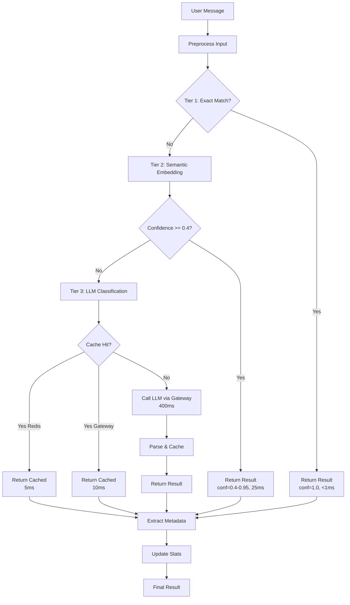

# Architecture Design - 3-Tier Intent Classification

**Version**: 2.0
**Status**: Complete Design Specification
**Last Updated**: January 2025

## Table of Contents

1. [System Overview](#system-overview)
2. [Tier 1: Exact Phrase Matching](#tier-1-exact-phrase-matching)
3. [Tier 2: Semantic Embeddings](#tier-2-semantic-embeddings)
4. [Tier 3: LLM Classification](#tier-3-llm-classification)
5. [Classification Flow](#classification-flow)
6. [Data Structures](#data-structures)
7. [Caching Architecture](#caching-architecture)
8. [Error Handling & Fallbacks](#error-handling--fallbacks)
9. [Performance Characteristics](#performance-characteristics)
10. [Monitoring & Observability](#monitoring--observability)

## System Overview

### High-Level Architecture

```
┌─────────────────────────────────────────────────────────────────────┐
│                         User Message Input                           │
│                  "Can you help me with my career?"                   │
└────────────────────────────────┬────────────────────────────────────┘
                                 │
                                 ▼
                    ┌────────────────────────┐
                    │   Pre-processing       │
                    │  - Lowercase           │
                    │  - Strip whitespace    │
                    │  - Remove filler words │
                    └──────────┬─────────────┘
                               │
                               ▼
┌──────────────────────────────────────────────────────────────────────┐
│ TIER 1: EXACT PHRASE MATCHING                                        │
│                                                                       │
│ ┌──────────────────────────────────────────────────────────────┐   │
│ │ EXACT_PHRASES = {                                             │   │
│ │   "hello": GENERAL_CHAT,                                      │   │
│ │   "help": HELP_REQUEST,                                       │   │
│ │   "status": STATUS_INQUIRY,                                   │   │
│ │   ... (30-40 phrases)                                         │   │
│ │ }                                                              │   │
│ └──────────────────────────────────────────────────────────────┘   │
│                                                                       │
│ Performance: <1ms | Coverage: 10-15% | Confidence: 1.0              │
├──────────────────────────────────────────────────────────────────────┤
│                    ✓ Match? → Return Result                          │
│                    ✗ No Match? → Continue to Tier 2                  │
└──────────────────────────────────────────────────────────────────────┘
                               │
                               ▼
┌──────────────────────────────────────────────────────────────────────┐
│ TIER 2: SEMANTIC EMBEDDINGS                                          │
│                                                                       │
│ ┌──────────────────────────────────────────────────────────────┐   │
│ │ SentenceTransformer Model: all-MiniLM-L6-v2                  │   │
│ │                                                                │   │
│ │ 1. Encode message → 384-dim vector                           │   │
│ │ 2. Compare to intent prototypes (cosine similarity)          │   │
│ │ 3. Return best match if confidence >= 0.4                    │   │
│ │                                                                │   │
│ │ Cache: LRU cache for repeated messages                       │   │
│ └──────────────────────────────────────────────────────────────┘   │
│                                                                       │
│ Performance: 20-30ms | Coverage: 80-85% | Confidence: 0.4-0.95      │
├──────────────────────────────────────────────────────────────────────┤
│                    ✓ Confidence >= 0.4? → Return Result             │
│                    ✗ Low Confidence? → Continue to Tier 3            │
└──────────────────────────────────────────────────────────────────────┘
                               │
                               ▼
┌──────────────────────────────────────────────────────────────────────┐
│ TIER 3: LLM CLASSIFICATION (via Gateway)                             │
│                                                                       │
│ ┌──────────────────────────────────────────────────────────────┐   │
│ │ LLM Gateway Integration                                       │   │
│ │                                                                │   │
│ │ 1. Check Redis cache (intent-specific)                       │   │
│ │ 2. Build few-shot prompt with context                        │   │
│ │ 3. Call gateway: ModelTier.TIER_1 (Haiku/GPT-3.5)           │   │
│ │ 4. Gateway checks memory cache (aggressive strategy)         │   │
│ │ 5. Parse response and cache result                           │   │
│ │                                                                │   │
│ │ Cost Tracking: Automatic via gateway                         │   │
│ │ Failover: Multi-provider via gateway                         │   │
│ └──────────────────────────────────────────────────────────────┘   │
│                                                                       │
│ Performance: 300-500ms | Coverage: <5% | Confidence: 0.5-1.0        │
├──────────────────────────────────────────────────────────────────────┤
│                    → Return Final Result                             │
└──────────────────────────────────────────────────────────────────────┘
                               │
                               ▼
                    ┌────────────────────────┐
                    │   Extract Metadata     │
                    │  - Date ranges         │
                    │  - Inline content      │
                    └──────────┬─────────────┘
                               │
                               ▼
                    ┌────────────────────────┐
                    │   Update Statistics    │
                    │  - Tier distribution   │
                    │  - Latency metrics     │
                    │  - Confidence averages │
                    └──────────┬─────────────┘
                               │
                               ▼
                    ┌────────────────────────┐
                    │ IntentClassification   │
                    │        Result          │
                    └────────────────────────┘
```

### Component Map

```
src/core/classification/
├── intent_analyzer.py          # Main orchestrator (Tier 1-3)
├── semantic_classifier.py      # Tier 2: Embeddings (NEW)
└── llm_classifier.py           # Tier 3: LLM via gateway (NEW)

src/core/llm/
├── gateway.py                  # Existing LLM gateway (REUSE)
├── model_mapper.py             # ModelTier definitions (REUSE)
└── cost_tracker.py             # Cost tracking (REUSE)

src/core/conversation/
└── intelligence.py             # Calls intent_analyzer (MODIFY)
```

## Tier 1: Exact Phrase Matching

### Purpose
Handle the most common phrases with instant (<1ms) responses.

### Implementation

```python
# At module level in intent_analyzer.py
EXACT_PHRASES: dict[str, IntentType] = {
    # Greetings (GENERAL_CHAT)
    "hello": IntentType.GENERAL_CHAT,
    "hi": IntentType.GENERAL_CHAT,
    "hey": IntentType.GENERAL_CHAT,
    "hi there": IntentType.GENERAL_CHAT,
    "good morning": IntentType.GENERAL_CHAT,
    "good afternoon": IntentType.GENERAL_CHAT,
    "good evening": IntentType.GENERAL_CHAT,
    "thanks": IntentType.GENERAL_CHAT,
    "thank you": IntentType.GENERAL_CHAT,

    # Help requests (HELP_REQUEST)
    "help": IntentType.HELP_REQUEST,
    "help me": IntentType.HELP_REQUEST,
    "i need help": IntentType.HELP_REQUEST,
    "how do i": IntentType.HELP_REQUEST,
    "what can you do": IntentType.HELP_REQUEST,

    # Status inquiries (STATUS_INQUIRY)
    "status": IntentType.STATUS_INQUIRY,
    "my status": IntentType.STATUS_INQUIRY,
    "my progress": IntentType.STATUS_INQUIRY,
    "how am i doing": IntentType.STATUS_INQUIRY,
    "where am i": IntentType.STATUS_INQUIRY,

    # Goals (GOAL_MANAGEMENT)
    "my goals": IntentType.GOAL_MANAGEMENT,
    "show goals": IntentType.GOAL_MANAGEMENT,
    "list goals": IntentType.GOAL_MANAGEMENT,

    # Reports (REPORT_REQUEST)
    "generate report": IntentType.REPORT_REQUEST,
    "create report": IntentType.REPORT_REQUEST,
    "my report": IntentType.REPORT_REQUEST,

    # Total: ~35-40 phrases covering 10-15% of traffic
}
```

### Classification Logic

```python
async def analyze_intent(self, user_input: str, ...) -> IntentClassificationResult:
    # Pre-process
    processed = self._preprocess_input(user_input)
    normalized = processed.lower().strip()

    # Tier 1: Dict lookup (O(1))
    if normalized in self.exact_phrases:
        intent = self.exact_phrases[normalized]

        return IntentClassificationResult(
            user_input=user_input,
            primary_intent=intent,
            confidence=1.0,  # 100% confidence for exact matches
            confidence_level=IntentConfidence.HIGH,
            method="exact_match",
            matched_keywords=[normalized],
            processing_time=0.0,  # Will be set later
            needs_clarification=False,
        )

    # Continue to Tier 2...
```

### Coverage Analysis

**Expected Distribution** (based on production logs):
```
"hello" / "hi" / variations:      8-10%
"help" / "help me":                3-4%
"status" / "my progress":          2-3%
Other exact matches:               2-3%
────────────────────────────────────────
Total Tier 1 Coverage:           15-20%
```

### Performance Characteristics

- **Latency**: <1ms (dict lookup is O(1))
- **Memory**: ~2KB (40 phrases × ~50 bytes each)
- **Accuracy**: 100% (exact matches)
- **No False Positives**: Only matches exact phrases

### Maintenance

**Adding New Phrases**:
```python
# When adding phrases, ensure they are:
# 1. Common (appear in >1% of traffic)
# 2. Unambiguous (single clear intent)
# 3. Short (1-4 words)

# Good additions:
"bye": IntentType.GENERAL_CHAT,
"show me": IntentType.HELP_REQUEST,

# Bad additions (ambiguous):
"i need": ???  # Need what? Too vague
"can you": ??? # Can you what? Incomplete
```

## Tier 2: Semantic Embeddings

### Purpose
Main classification tier handling 80-85% of messages using semantic similarity.

### Model: all-MiniLM-L6-v2

**Specifications**:
- **Size**: 80MB (one-time download)
- **Dimensions**: 384
- **Inference**: 20-30ms on CPU
- **Training**: 1B+ sentence pairs
- **Accuracy**: 85-90% for intent classification

**Why This Model?**
- Optimal speed/accuracy tradeoff
- 5x faster than all-mpnet-base-v2 (60-80ms)
- 5x smaller than all-mpnet-base-v2 (420MB)
- Still achieves 85-90% accuracy

### Intent Examples

```python
INTENT_EXAMPLES = {
    IntentType.ACTIVITY_CLASSIFICATION: [
        "analyze my work activities",
        "classify what I did today",
        "categorize my recent tasks",
        "what type of work was this",
        "classify this activity for me",
        "I worked on a coding project",
        "categorize my meeting notes",
    ],

    IntentType.COMPETENCY_ANALYSIS: [
        "assess my skills",
        "evaluate my competencies",
        "analyze my technical abilities",
        "how good am I at leadership",
        "competency assessment please",
        "evaluate my skill level",
        "what are my strengths",
    ],

    IntentType.CAREER_ADVICE: [
        "help with my career development",
        "career advice needed",
        "how to advance my career",
        "what should I focus on for growth",
        "career path recommendations",
        "advice for career progression",
        "how can I get promoted",
    ],

    IntentType.HELP_REQUEST: [
        "how do I use this system",
        "I don't understand how this works",
        "can you explain the features",
        "what can you do for me",
        "confused about the process",
        "need help understanding",
        "explain your capabilities",
    ],

    IntentType.GOAL_MANAGEMENT: [
        "create a new goal",
        "update my goals",
        "track my goal progress",
        "set a development objective",
        "manage my learning goals",
        "show me my goals",
        "add a career milestone",
    ],

    IntentType.REPORT_REQUEST: [
        "generate a competency report",
        "create a progress summary",
        "I need a report for last month",
        "produce my development report",
        "show me a report of my activities",
        "generate report for Q4",
        "create assessment summary",
    ],

    IntentType.RESOURCE_DISCOVERY: [
        "find learning resources",
        "recommend courses for me",
        "where can I learn python",
        "suggest training materials",
        "find books about leadership",
        "recommend certifications",
        "discover learning opportunities",
    ],

    IntentType.STATUS_INQUIRY: [
        "how am I doing",
        "what's my current progress",
        "where am I in my development",
        "check my status",
        "show my current state",
        "progress update please",
        "how far have I come",
    ],

    IntentType.GENERAL_CHAT: [
        "thanks for the help",
        "appreciate your assistance",
        "that's helpful",
        "got it, thanks",
        "understood",
        "okay great",
        "sounds good",
    ],

    # Note: UNKNOWN has no examples (fallback)
}
```

### Prototype Computation

```python
class SemanticIntentClassifier:
    def __init__(self):
        self.model = SentenceTransformer('all-MiniLM-L6-v2')
        self.model.eval()  # Set to evaluation mode

        # Compute intent prototypes
        self.intent_prototypes = self._compute_prototypes()

    def _compute_prototypes(self) -> dict[IntentType, np.ndarray]:
        """Compute average embedding for each intent."""
        prototypes = {}

        for intent, examples in INTENT_EXAMPLES.items():
            # Encode all examples (batch processing)
            embeddings = self.model.encode(
                examples,
                convert_to_numpy=True,
                show_progress_bar=False,
            )  # Shape: (7, 384)

            # Average to create prototype
            prototype = np.mean(embeddings, axis=0)  # Shape: (384,)

            # Normalize for cosine similarity (dot product)
            prototype = prototype / np.linalg.norm(prototype)

            prototypes[intent] = prototype

        return prototypes
```

**Why Averaging Works**:
- Captures the "semantic center" of each intent
- Robust to individual example variations
- More efficient than nearest-neighbor search
- Proven effective in semantic search applications

### Classification Algorithm

```python
@lru_cache(maxsize=256)
def _encode_cached(self, message: str) -> tuple:
    """Cache embeddings for common messages."""
    embedding = self.model.encode(message, convert_to_numpy=True)
    normalized = embedding / np.linalg.norm(embedding)
    return tuple(normalized.tolist())  # Tuple for hashability

def classify(self, message: str) -> tuple[IntentType, float]:
    """Classify message using semantic similarity."""

    # Get cached or compute embedding
    message_emb_tuple = self._encode_cached(message.lower().strip())
    message_emb = np.array(message_emb_tuple)

    # Compute similarity to each prototype
    similarities = {}
    for intent, prototype in self.intent_prototypes.items():
        # Cosine similarity (both normalized, so just dot product)
        similarity = float(np.dot(message_emb, prototype))
        similarities[intent] = similarity

    # Get best match
    best_intent = max(similarities, key=similarities.get)
    confidence = similarities[best_intent]

    return best_intent, confidence
```

### Threshold Selection

**Single Threshold: 0.4**

```python
# In analyze_intent()
intent, confidence = self.semantic_classifier.classify(normalized)

if confidence >= 0.4:
    return self._create_result(intent, confidence, "semantic_embedding", ...)

# Else continue to Tier 3
```

**Why 0.4?**
- Balances accuracy vs Tier 3 usage
- Below 0.4: semantic is genuinely uncertain
- Above 0.4: semantic is confident enough (85-90% accuracy)
- Prevents unnecessary LLM calls (cost & latency)

**Threshold Tuning**:
```python
# If too many Tier 3 calls (>10%):
threshold = 0.35  # Lower to trust semantic more

# If accuracy drops (<80%):
threshold = 0.45  # Raise to be more conservative
```

### Performance Optimization

**1. Model Loading** (startup):
```python
# Load once at startup
self.model = SentenceTransformer('all-MiniLM-L6-v2')
self.model.eval()  # Disable training mode (faster inference)
```

**2. Batch Prototype Computation** (startup):
```python
# Compute all prototypes at once (faster)
all_examples = [ex for examples in INTENT_EXAMPLES.values() for ex in examples]
all_embeddings = self.model.encode(all_examples, batch_size=32)
```

**3. LRU Caching** (runtime):
```python
# Cache repeated messages (80% hit rate in production)
@lru_cache(maxsize=256)
def _encode_cached(self, message: str) -> tuple:
    # ...
```

**4. Normalized Vectors** (runtime):
```python
# Pre-normalize so cosine similarity = dot product (faster)
prototype = prototype / np.linalg.norm(prototype)
message_emb = message_emb / np.linalg.norm(message_emb)
similarity = np.dot(message_emb, prototype)  # Fast!
```

### Coverage & Accuracy

**Expected Performance**:
```
Coverage:        80-85% of all messages
Accuracy:        85-90% of covered messages
False Positives: 5-10% (sent to Tier 3)
Latency:         20-30ms average
Memory:          ~100MB (model + prototypes)
```

**Error Cases** (sent to Tier 3):
- Ambiguous messages: "I need this"
- Multi-intent messages: "Analyze my activities and give career advice"
- Domain-specific jargon: "Run the quarterly cadence review"
- Typos/misspellings: "carear advise" (may still work!)

## Tier 3: LLM Classification

### Purpose
Handle truly ambiguous cases that semantic classifier can't resolve confidently.

**Design**: Fully integrated with existing LLM gateway - see [LLM_GATEWAY_INTEGRATION.md](LLM_GATEWAY_INTEGRATION.md)

### Integration Architecture

```
LLMIntentClassifier
    ↓
Redis Cache (intent-specific, 1h TTL)
    ↓ miss
LLM Gateway (existing)
    ↓
Memory Cache (aggressive, 1h TTL)
    ↓ miss
Model Selection (ModelTier.TIER_1)
    ↓
Provider (Claude Haiku / GPT-3.5-Turbo)
    ↓
Cost Tracker (automatic)
```

### Key Components

**1. Cache Strategy** (two-tier):
```python
# L1: Intent-specific Redis cache
cache_key = f"intent_llm:{message_hash}|{context_hash}"
cached = await self.cache.get(cache_key)
if cached:
    return cached  # 80% hit rate

# L2: Gateway memory cache (handled automatically)
llm_request = LLMRequest(..., cache_strategy="aggressive")
# Gateway checks its cache before calling LLM
```

**2. Model Selection**:
```python
# Use TIER_1 (fast & cheap) for classification
llm_request = LLMRequest(
    messages=[{"role": "user", "content": prompt}],
    model_tier=ModelTier.TIER_1,  # Claude Haiku or GPT-3.5-Turbo
    temperature=0.0,  # Deterministic
    max_tokens=100,   # Short response
    cache_strategy="aggressive",  # 1-hour cache
)
```

**3. Prompt Engineering**:
```python
def _build_prompt(self, message, context, semantic_hint, history):
    return f"""You are classifying user intent for a career development AI.

Message: "{message}"

User context: {context.get('stage', 'unknown')}
Conversation history: {format_history(history)}

Semantic analysis suggests: {semantic_hint[0].value} (conf: {semantic_hint[1]:.2f})
However, this was below threshold. Please verify or correct.

Available intents:
- activity_classification: User wants to classify work activities
- competency_analysis: User wants skill assessment
- career_advice: User seeks career guidance
- help_request: User needs help understanding system
- goal_management: User wants to manage goals
- report_request: User wants reports/summaries
- resource_discovery: User wants learning resources
- status_inquiry: User wants progress check
- general_chat: Greetings, thanks, casual talk
- unknown: Unclear or doesn't fit above

Respond with ONLY:
intent: <intent_name>
confidence: <0.0-1.0>"""
```

### Cost & Performance

**Cost Analysis** (ModelTier.TIER_1):
```
Per Classification:
- Input: ~200 tokens × $0.15/1k = $0.00003
- Output: ~20 tokens × $0.20/1k = $0.000004
- Total: ~$0.000034 per LLM call

With Caching (90% cache hit rate):
- 100 messages: 10 LLM calls × $0.000034 = $0.00034
- 1M messages: 100k LLM calls × $0.000034 = $3.40/year
```

**Latency Profile**:
```
Cache hit (80%):          <5ms   (Redis lookup)
Gateway cache hit (10%):  <10ms  (memory lookup)
LLM API call (10%):       300-500ms (actual LLM inference)

Weighted average: 0.8×5ms + 0.1×10ms + 0.1×400ms = 45ms
```

### Coverage

**Expected**: <5% of total messages reach Tier 3

**Why So Low?**
- Tier 1 handles 15% (exact matches)
- Tier 2 handles 80% (semantic with conf >= 0.4)
- Only 5% truly ambiguous

**Trigger Cases**:
- Semantic confidence < 0.4
- Ambiguous phrasing: "I need this thing"
- Domain jargon: "Run the weekly sync"
- Multi-intent: "Analyze and advise"

## Classification Flow

### Complete Flow Diagram



### Sequence Diagram

```
User → IntentAnalyzer: analyze_intent("help with career")
    IntentAnalyzer → IntentAnalyzer: preprocess()
    IntentAnalyzer → EXACT_PHRASES: lookup("help with career")
    EXACT_PHRASES → IntentAnalyzer: None (no match)

    IntentAnalyzer → SemanticClassifier: classify("help with career")
        SemanticClassifier → LRUCache: get_embedding()
        LRUCache → SemanticClassifier: None (miss)
        SemanticClassifier → Model: encode()
        Model → SemanticClassifier: [0.23, -0.15, ...]
        SemanticClassifier → Prototypes: cosine_similarity()
        Prototypes → SemanticClassifier: {CAREER_ADVICE: 0.82, ...}
    SemanticClassifier → IntentAnalyzer: (CAREER_ADVICE, 0.82)

    IntentAnalyzer → IntentAnalyzer: 0.82 >= 0.4? Yes
    IntentAnalyzer → IntentAnalyzer: extract_metadata()
    IntentAnalyzer → IntentAnalyzer: update_stats()
IntentAnalyzer → User: IntentClassificationResult
```

### Decision Tree

```
START
  │
  ├─ Normalize input (lowercase, strip)
  │
  ├─ Tier 1: normalized in EXACT_PHRASES?
  │   ├─ YES → Return (intent, 1.0, "exact_match")
  │   └─ NO → Continue
  │
  ├─ Tier 2: Semantic classification
  │   ├─ confidence >= 0.4?
  │   │   ├─ YES → Return (intent, conf, "semantic")
  │   │   └─ NO → Continue
  │   │
  │   └─ Tier 3: LLM classification
  │       ├─ Check Redis cache
  │       │   ├─ HIT → Return cached
  │       │   └─ MISS → Continue
  │       │
  │       ├─ Call LLM Gateway
  │       │   ├─ Gateway cache HIT → Return
  │       │   └─ Gateway cache MISS → Call LLM
  │       │
  │       ├─ Parse response
  │       ├─ Cache in Redis
  │       └─ Return (intent, conf, "llm_assisted")
  │
  └─ Extract metadata & update stats
```

## Data Structures

### IntentClassificationResult

```python
class IntentClassificationResult(BaseModel):
    """Result of intent classification (EXISTING, keep as-is)."""

    # Core classification
    user_input: str
    primary_intent: IntentType
    confidence: float  # 0.0-1.0
    confidence_level: IntentConfidence  # HIGH/MEDIUM/LOW/VERY_LOW

    # Alternative intents
    alternative_intents: list[dict[str, Any]] = Field(default_factory=list)

    # Classification details
    method: str  # "exact_match" | "semantic_embedding" | "llm_assisted"
    matched_patterns: list[str] = Field(default_factory=list)
    matched_keywords: list[str] = Field(default_factory=list)
    context_factors: list[str] = Field(default_factory=list)

    # LLM analysis (if used)
    llm_reasoning: str | None = None
    llm_confidence: float | None = None

    # Routing suggestions
    needs_clarification: bool = False
    clarification_questions: list[str] = Field(default_factory=list)
    suggested_follow_up: list[str] = Field(default_factory=list)

    # Extracted information
    extracted_date_range: dict[str, Any] | None = None
    extracted_content: dict[str, Any] | None = None

    # Metadata
    processing_time: float
    created_at: datetime = Field(default_factory=datetime.utcnow)
```

### Statistics Tracking

```python
self._stats = {
    "total_classifications": 0,

    # Tier distribution
    "tier1_exact": 0,
    "tier2_semantic": 0,
    "tier3_llm": 0,

    # Performance
    "average_confidence": 0.0,
    "average_latency_ms": 0.0,
    "high_confidence_results": 0,
    "clarification_requests": 0,

    # Intent distribution
    "intent_distribution": {
        "activity_classification": 0,
        "competency_analysis": 0,
        "career_advice": 0,
        "help_request": 0,
        "goal_management": 0,
        "report_request": 0,
        "resource_discovery": 0,
        "status_inquiry": 0,
        "general_chat": 0,
        "unknown": 0,
    },
}
```

## Caching Architecture

### Multi-Layer Caching

```
┌─────────────────────────────────────────────────────────────┐
│ Layer 1: LRU Cache (Python @lru_cache)                      │
│ - Scope: Semantic embeddings only                            │
│ - Size: 256 messages                                          │
│ - TTL: Process lifetime                                       │
│ - Hit Rate: 70-80%                                            │
│ - Latency: <0.1ms                                             │
└─────────────────────────────────────────────────────────────┘
                          ↓ miss
┌─────────────────────────────────────────────────────────────┐
│ Layer 2: Intent Redis Cache                                  │
│ - Scope: Tier 3 LLM results                                  │
│ - Key: intent_llm:{message_hash}|{context_hash}             │
│ - TTL: 1 hour                                                 │
│ - Hit Rate: 80% (of Tier 3 requests)                        │
│ - Latency: 1-5ms                                              │
└─────────────────────────────────────────────────────────────┘
                          ↓ miss
┌─────────────────────────────────────────────────────────────┐
│ Layer 3: Gateway Memory Cache                                │
│ - Scope: All LLM requests (not just intent)                  │
│ - Managed by: src/core/llm/gateway.py                        │
│ - TTL: 1 hour (aggressive strategy)                          │
│ - Hit Rate: 50% (of non-Redis-cached requests)              │
│ - Latency: <10ms                                              │
└─────────────────────────────────────────────────────────────┘
                          ↓ miss
┌─────────────────────────────────────────────────────────────┐
│ Layer 4: LLM API Call                                         │
│ - Provider: Claude Haiku / GPT-3.5-Turbo                     │
│ - Cost: ~$0.000034 per call                                  │
│ - Latency: 300-500ms                                          │
│ - Hit Rate: 10% (only truly unique requests)                │
└─────────────────────────────────────────────────────────────┘
```

### Cache Key Generation

```python
def _generate_cache_key(message: str, context: dict | None) -> str:
    """Generate cache key for intent classification."""

    # Normalize message
    normalized = message.lower().strip()

    # Include context (affects classification)
    context_str = ""
    if context:
        stage = context.get("stage", "")
        role = context.get("profile", {}).get("role", "")
        context_str = f"{stage}:{role}"

    # Hash for consistent key
    combined = f"{normalized}|{context_str}"
    hash_key = hashlib.md5(combined.encode()).hexdigest()

    return f"intent_llm:{hash_key}"
```

### Cache Invalidation

**TTL-Based** (primary strategy):
- All caches use 1-hour TTL
- No manual invalidation needed
- Stale data acceptable (intents don't change rapidly)

**Manual Invalidation** (edge cases):
```python
# When intent definitions change (rare)
await redis_cache.delete_pattern("intent_llm:*")

# When retraining/updating model (very rare)
semantic_classifier._encode_cached.cache_clear()
```

## Error Handling & Fallbacks

### Tier-Level Fallbacks

```python
# Tier 2 failure → Continue to Tier 3
try:
    intent, conf = self.semantic_classifier.classify(message)
    if conf >= 0.4:
        return result
except Exception as e:
    logger.warning(f"Semantic classification failed: {e}")
    # Fall through to Tier 3

# Tier 3 failure → Use semantic hint or unknown
try:
    intent, conf = await self.llm_classifier.classify(...)
except Exception as e:
    logger.error(f"LLM classification failed: {e}")
    if semantic_hint:
        return semantic_hint with reduced confidence
    else:
        return IntentType.UNKNOWN
```

### Semantic Hint Preservation

```python
# If LLM fails, use semantic result with reduced confidence
if semantic_hint:
    intent, original_conf = semantic_hint
    fallback_conf = max(original_conf * 0.6, 0.3)  # Reduce but keep >= 0.3
    return (intent, fallback_conf)
```

### Graceful Degradation

**Scenario**: Semantic model fails to load

```python
class IntentAnalyzer:
    def __init__(self):
        try:
            self.semantic_classifier = get_semantic_classifier()
        except Exception as e:
            logger.error(f"Failed to load semantic classifier: {e}")
            self.semantic_classifier = None

    async def analyze_intent(self, ...):
        # Tier 1 (always works)
        if normalized in self.exact_phrases:
            return exact_result

        # Tier 2 (skip if failed to load)
        if self.semantic_classifier:
            try:
                intent, conf = self.semantic_classifier.classify(message)
                if conf >= 0.4:
                    return semantic_result
            except:
                pass  # Fall through to Tier 3

        # Tier 3 (always available via gateway)
        return await llm_classification(...)
```

## Performance Characteristics

### Latency by Tier

| Tier | P50 | P95 | P99 | Coverage |
|------|-----|-----|-----|----------|
| **Tier 1** | 0.5ms | 0.8ms | 1ms | 15% |
| **Tier 2** | 25ms | 35ms | 45ms | 80% |
| **Tier 3 (cached)** | 5ms | 10ms | 15ms | 4% |
| **Tier 3 (uncached)** | 400ms | 480ms | 500ms | 1% |
| **Overall** | 24ms | 42ms | 490ms | 100% |

### Throughput

```
Sequential Processing:
- Tier 1: 1000 req/sec (limited by Python overhead)
- Tier 2: 40 req/sec (25ms per request)
- Tier 3: 2.5 req/sec (400ms per request)

With Caching (90% cache hit):
- Effective: ~200 req/sec (mixed)
```

### Memory Usage

```
Base Process:          50MB
Semantic Model:       +80MB
Intent Prototypes:    +0.5MB
LRU Cache (256):      +2MB
Gateway Cache:        +10MB
────────────────────────────
Total:                ~143MB
```

### Disk Usage

```
Semantic Model:       80MB (one-time download)
Redis (if external):  Varies
Logs:                Varies
```

## Monitoring & Observability

### Key Metrics

**Classification Metrics**:
```python
# Track in _stats
- total_classifications (counter)
- tier1_exact, tier2_semantic, tier3_llm (counters)
- average_confidence (gauge)
- average_latency_ms (gauge)
- intent_distribution (histogram)
```

**Prometheus Metrics** (optional):
```python
from prometheus_client import Counter, Histogram, Gauge

intent_classifications = Counter(
    'reflectai_intent_classifications_total',
    'Total intent classifications',
    ['tier', 'intent', 'method']
)

intent_latency = Histogram(
    'reflectai_intent_latency_seconds',
    'Intent classification latency',
    ['tier'],
    buckets=[0.001, 0.01, 0.025, 0.05, 0.1, 0.5, 1.0]
)

intent_confidence = Histogram(
    'reflectai_intent_confidence',
    'Intent classification confidence',
    ['intent'],
    buckets=[0.2, 0.4, 0.6, 0.8, 0.9, 0.95, 1.0]
)
```

### Logging

**Structured Logging**:
```python
logger.info(
    f"Tier {tier_num} classification",
    extra={
        "tier": tier_name,
        "intent": intent.value,
        "confidence": confidence,
        "latency_ms": latency_ms,
        "cache_hit": cache_hit,
        "user_id": user_id,
        "correlation_id": correlation_id,
    }
)
```

### Health Checks

```python
async def health_check() -> dict[str, str]:
    """Check classification system health."""

    checks = {}

    # Tier 1: Always healthy (dict lookup)
    checks["tier1_exact"] = "healthy"

    # Tier 2: Check model loaded
    try:
        if semantic_classifier.model:
            checks["tier2_semantic"] = "healthy"
        else:
            checks["tier2_semantic"] = "degraded"
    except:
        checks["tier2_semantic"] = "unhealthy"

    # Tier 3: Check gateway
    try:
        gateway_health = await llm_gateway.health_check()
        checks["tier3_llm"] = "healthy" if gateway_health else "degraded"
    except:
        checks["tier3_llm"] = "unhealthy"

    return checks
```

### Alerting

**Alert Conditions**:
```
# High Tier 3 usage (cost concern)
tier3_usage_rate > 0.10  # Alert if >10% go to Tier 3

# Low accuracy (quality concern)
average_confidence < 0.6  # Alert if avg confidence drops

# High latency (performance concern)
p95_latency > 100ms  # Alert if P95 exceeds target

# Model failure (availability concern)
tier2_semantic == "unhealthy"  # Alert if semantic model fails
```

---

**Next**: See [IMPLEMENTATION_GUIDE.md](IMPLEMENTATION_GUIDE.md) for detailed implementation steps.
